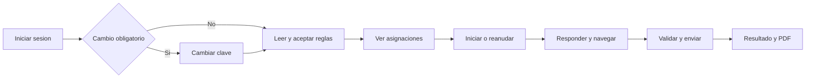

# 02 - Personas, jornadas y casos de uso

| Campo | Valor |
|---|---|
| Estado | Implementado |
| Versión | 1.0 |
| Fecha | 2026-08-16 |
| Trazabilidad | [Rutas](11-api-route-reference.md), `tests/test_core.py` |

## Personas

| Persona | Objetivo | Necesidad | Riesgo principal |
|---|---|---|---|
| Administrador institucional | Preparar el entorno y administrar docentes | Configuración coherente y controles de seguridad | Alterar catálogo compartido o dejar sin administrador activo |
| Docente | Crear y aplicar evaluaciones, revisar resultados | Flujo rápido y aislamiento de su contenido | IDOR, versiones incompletas, interpretación injusta de telemetría |
| Estudiante | Resolver su evaluación sin ambigüedad | Acceso estable, navegación clara y resultado comprensible | Pérdida de progreso, bloqueo de navegación, privacidad |
| Operador TI | Mantener la aplicación disponible | Configuración, respaldo, restauración y observabilidad | Corrupción/pérdida de DB o audio, secretos débiles |

## Jornadas resumidas

### Administrador

1. Inicia sesión en `/teacher`.
2. Crea o mantiene cuentas docentes en `/teacher/users`.
3. Mantiene asignaturas y categorías compartidas en `/teacher/catalog`.
4. Configura institución, idioma, límite de audio y reglas bilingües en `/teacher/setup`.
5. Verifica que exista al menos un administrador activo.

### Docente

1. Inicia sesión y consulta métricas/resultados.
2. Usa el padrón institucional compartido o importa estudiantes.
3. Crea/importa preguntas propias.
4. Crea examen, versiones y selección de preguntas.
5. Asigna por sección y publica.
6. Revisa resultados, telemetría contextual y exporta.
7. Si corresponde, aplica o revoca una penalización manual justificada.

### Estudiante

1. Inicia sesión con correo y contraseña.
2. Cambia contraseña si la cuenta lo exige.
3. Acepta las reglas vigentes para la sesión.
4. Inicia o reanuda una evaluación asignada.
5. Responde cada pregunta; no puede avanzar sobre una respuesta inválida.
6. Revisa y envía una sola vez.
7. Consulta resultado ajustado y descarga PDF sin clave de respuestas.

## Catálogo de casos de uso

Cada fila contiene precondición; flujo feliz; alternativas/errores; postcondición; seguridad; y trazabilidad.

| ID | Actor | Caso | Precondición | Flujo feliz | Alternativas/errores | Postcondición | Seguridad | Rutas/pruebas |
|---|---|---|---|---|---|---|---|---|
| UC-A01 | Admin/docente | Autenticarse | Cuenta activa | Envía correo/clave y recibe sesión | Credenciales inválidas -> mensaje genérico | `last_login_at` actualizado | Hash Werkzeug; sesión regenerada con `session.clear()` | `GET/POST /teacher`; pruebas de roles y dashboard |
| UC-A02 | Admin | Gestionar docente | Sesión admin | Crea, edita, restablece o activa/desactiva | Email duplicado; no puede desactivar sesión propia ni último admin | Cuenta persistida | POST+CSRF; `admin_required` | `/teacher/users*`; `test_setup_is_admin_only` cubre rol de forma indirecta |
| UC-A03 | Admin/docente | Cambiar clave propia | Sesión docente | Verifica clave actual y define otra válida | Clave actual incorrecta; confirmación distinta | Hash reemplazado | POST+CSRF; 8-128, letra y número | `/teacher/account/password`; sin prueba específica |
| UC-A04 | Admin | Configurar institución | Sesión admin | Guarda nombre, idioma, audio y reglas | Datos obligatorios ausentes | `app_settings` actualizado | POST+CSRF; `admin_required` | `/teacher/setup`; `test_setup_*` |
| UC-A05 | Admin | Mantener catálogo | Sesión admin | Crea/edita/archiva asignatura o categoría | Duplicado; última asignatura no se archiva | Catálogo compartido actualizado | POST+CSRF; cascada lógica de archivo | `/teacher/subjects*`, `/teacher/categories*`; cobertura parcial |
| UC-R01 | Docente | Consultar padrón | Sesión docente | Filtra estudiantes/secciones | Sin resultados -> estado vacío | Sin mutación | Padrón compartido por diseño | `GET /teacher/students`; pruebas de tablas responsivas |
| UC-R02 | Docente | Crear/editar estudiante | Sección activa | Registra identidad, correo, clave y estado | Email/NIE duplicado o datos inválidos | Cuenta compartida disponible | POST+CSRF; hash; clave visible una vez | `/teacher/students/new`, `/<id>/edit`; pruebas de UI |
| UC-R03 | Docente | Importar estudiantes CSV | Sección y archivo válido | Valida fila por fila, genera/lee correo y crea válidos | Filas inválidas/duplicadas se omiten; archivo inválido se rechaza | Válidos insertados y resumen mostrado | POST+CSRF; sin sobrescritura silenciosa | `/teacher/students/import`; `test_bulk_student_csv_import_*` |
| UC-R04 | Docente | Restablecer/archivar estudiante | Estudiante existente | Define hash nuevo o marca archivado/inactivo | Sin email no restablece; ID inexistente -> 404 | Acceso actualizado, historia preservada | POST+CSRF | `/teacher/students/<id>/*`; cobertura de markup |
| UC-R05 | Docente | Gestionar sección | Sesión docente | Crea/edita; archiva solo sin estudiantes vigentes | Nombre duplicado o sección ocupada | Padrón reorganizado | POST+CSRF; compartido institucional | `/teacher/sections/*`; cobertura de markup |
| UC-Q01 | Docente | Crear/editar pregunta | Catálogo activo | Elige tipo, valida datos y guarda en banco propio | Tipo/datos/audio inválidos | Pregunta disponible para versiones futuras | POST+CSRF; `teacher_id`; respuestas solo servidor/snapshot | `/teacher/questions/new`, `/<qid>/edit`; pruebas de scoring |
| UC-Q02 | Docente | Importar preguntas CSV | Defaults o nombres existentes | Valida cada fila y crea preguntas inactivas | Filas inválidas se omiten; listening incompleto queda no utilizable | Preguntas válidas insertadas | POST+CSRF; `teacher_id`; `secure_filename` | `/teacher/questions/import`; pruebas multi-tipo/listening |
| UC-Q03 | Docente | Duplicar/archivar/bulk | Pregunta propia | Duplica inactiva o archiva selección | Registro ajeno/inexistente -> 404 | Banco propio actualizado | Propiedad en consulta y UPDATE | `/teacher/questions/<qid>/*`, `/bulk`; prueba de clonación |
| UC-E01 | Docente | Crear/editar examen | Sesión docente y asignatura activa | Crea examen borrador con versión A | Título/asignatura inválidos | `exams` y `exam_versions` creados | POST+CSRF; `teacher_id` | `/teacher/exams/new`, `/<id>/edit`; cobertura indirecta |
| UC-E02 | Docente | Gestionar versiones | Examen propio | Crea, renombra, duplica, archiva/restaura | Nombre duplicado; versión fija activa; última usable publicada | Ciclo de versión actualizado | Propiedad por `exam_row`; POST+CSRF | `/versions/*`; `test_version_archive_and_restore_routes_exist` |
| UC-E03 | Docente | Seleccionar preguntas | Examen/versión propios | Elige preguntas propias de la misma asignatura | Listening sin fuente u IDs ajenos se descartan | M:N y posiciones reemplazadas | Validación server-side de owner/subject/source | `/versions/<id>/questions`; prueba listening |
| UC-E04 | Docente | Asignar a sección | Examen propio | Configura `random` o `fixed` | Sección/versión inválida | Asignación activa por examen/sección | POST+CSRF; versión pertenece al examen | `/teacher/exams/<id>/assign`; cobertura indirecta |
| UC-E05 | Docente | Publicar/archivar examen | Examen propio | Publica con versión usable o archiva y desactiva asignaciones | No hay preguntas en versión activa | Estado del examen actualizado | POST+CSRF; propiedad | `/publish`, `/archive`; cobertura indirecta |
| UC-S01 | Estudiante | Autenticarse | Cuenta/sección activas | Envía correo/clave | Cuenta inactiva/archivada o clave inválida | Sesión y `last_login_at` | Hash; respuesta genérica; POST+CSRF | `POST /start`; `test_student_login_*` |
| UC-S02 | Estudiante | Cambiar clave obligatoria | Sesión y `must_change_password=1` | Define clave válida | Confirmación inválida | `must_change_password=0` | POST+CSRF; hash | `/student/password`; `test_student_login_*` |
| UC-S03 | Estudiante | Aceptar reglas | Sesión estudiante | Lee, marca aceptación y envía versión actual | Sin marca o versión obsoleta | Aceptación en sesión | POST+CSRF; no permite bypass de inicio | `/student/rules/acknowledge`; `test_rules_acknowledgment_*` |
| UC-S04 | Estudiante | Ver asignaciones | Sesión y padrón activo | Consulta exámenes de su sección | Sin asignaciones -> estado vacío | Sin mutación | Filtro por `section_id`, publicación y actividad | `GET /student`; prueba de estadísticas |
| UC-S05 | Estudiante | Iniciar/reanudar | Reglas aceptadas y asignación válida | Reutiliza intento o asigna versión y crea snapshot | Ya enviado -> resultado; sin versión usable -> error | Intento estable `in_progress` | Unicidad DB, propiedad, snapshot y transacción | `/student/exams/<id>/start`; pruebas de login/attempt |
| UC-S06 | Estudiante | Resolver y navegar | Intento propio en progreso | Responde y avanza; borrador local | Respuesta inválida bloquea avance | Borrador local/servidor preservado | Clave no renderizada; validación cliente no canónica | `GET /exam`, `exam.js`; pruebas no-skip |
| UC-S07 | Estudiante | Reproducir listening | Pregunta listening del snapshot | Reproduce archivo o solicita script TTS al pulsar | Sin soporte/guion -> aviso | Conteo de reproducción solo cliente | Endpoint autenticado, attempt/question scoped, `no-store` | `/api/listening-script/<question_id>`; prueba de no exposición |
| UC-S08 | Estudiante | Enviar intento | Intento propio `in_progress` | Servidor valida todas, califica y marca `submitted` | Incompleta/malformada -> conserva draft | Resultado inmutable y no repetible | CSRF; ownership; snapshot canónico | `POST /submit`; pruebas required/ownership |
| UC-I01 | Estudiante/sistema | Registrar señal de integridad | Intento propio en progreso | JS envía tipo soportado y servidor registra | Tipo no soportado 400; intento cerrado 409 | Contadores y evento persistidos | No usa CSRF token; exige sesión/ownership y allowlist | `/api/integrity-event`; pruebas de presentación |
| UC-I02 | Docente | Revisar señales | Intento propio enviado | Consulta resumen, timeline y detalles | Intento ajeno -> 403 | Sin mutación | Solo owner; telemetría no es prueba | `/result/<attempt_id>`; pruebas owner/student |
| UC-I03 | Docente | Aplicar/revocar penalización | Intento propio enviado | Ingresa puntos y motivo; puede revocar | Motivo vacío, no finito, <=0 o supera nota disponible | Historial auditable; nota raw intacta | POST+CSRF; owner estricto, sin bypass admin | `/teacher/results/*/penalties`; pruebas de tenancy/cap |
| UC-O01 | Docente/estudiante | Ver resultado/PDF | Intento enviado propio | Consulta resumen y descarga PDF | No autorizado 403; no enviado 404 | Documento sin clave | Ownership por estudiante o docente owner | `/result/*`, `/report/*.pdf`; pruebas PDF/privacidad |
| UC-O02 | Docente | Exportar resultados | Sesión docente | Aplica filtros y descarga CSV/XLSX | Sin filas -> archivo con encabezados | Exportación tenant/filter scoped | `teacher_required`; filtro por `teacher_id` | `/teacher/export.*`; pruebas de penalización/export |

## Diagrama de jornada estudiantil

Los diagramas técnicos completos están en [12 - Diagramas](12-diagrams.md).
