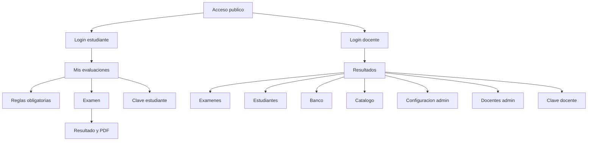
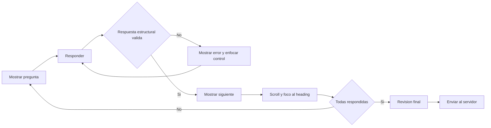

# 04 - Arquitectura de información y sistema de diseño

| Campo | Valor |
|---|---|
| Estado | Implementado; auditoría WCAG formal recomendada |
| Versión | 1.0 |
| Fecha | 2026-08-16 |
| Fuentes | `templates/`, `static/css/style.css`, `static/css/dashboard.css`, `static/js/ui.js`, `static/js/exam.js` |

## Principios de experiencia

- Priorizar la tarea actual y reducir acciones irreversibles.
- Mantener controles cómodos y texto de formulario de 16px en móvil.
- Mostrar estado, contexto y consecuencias antes de una acción.
- Conservar términos, orden y patrones entre español e inglés.
- No usar ocultamiento visual como autorización.
- Reducir movimiento cuando `prefers-reduced-motion` está activo.
- Conservar foco y navegación por teclado en modales y cambios de pregunta.

## Arquitectura de información

## Modelo de navegación docente

| Viewport | Patrón implementado | Umbral |
|---|---|---|
| Escritorio | Sidebar sticky expandido; rail colapsable persistido en `localStorage` | >=1120px |
| Tableta | Rail compacto permanente junto al workspace | 768-1119px |
| Móvil | App bar superior, bottom navigation de cinco elementos y sheet “More” | <768px |
| Móvil estrecho | Acciones y tablas pasan a una columna | <=430px, con ajustes adicionales heredados |

La navegación móvil primaria contiene Results, Exams, Students, Bank y More. More abre un diálogo con Catalog, Setup/Teachers para admin, seguridad de cuenta y logout POST+CSRF.

## Inventario de pantallas

| Pantalla | Template | Audiencia | Estados clave |
|---|---|---|---|
| Login estudiante | `index.html` | Pública | normal, error de credenciales |
| Dashboard estudiante | `student_dashboard.html` | Student | asignaciones, vacío, reglas bloqueantes |
| Cambio de clave estudiante | `student_password.html` | Student | forzado, voluntario, validación |
| Examen | `exam.html` | Student | pregunta, inválida, revisión, listening |
| Resultado | `result.html` | Student/owner teacher | limpio, review, penalizaciones, timeline docente |
| Login docente | `teacher_login.html` | Pública | normal, error |
| Dashboard resultados | `teacher.html` | Teacher/admin | KPIs, filtros, tabla, vacío |
| Padrón | `teacher_students.html` | Teacher/admin | tablas/card, modales, credenciales one-time, import summary |
| Banco | `question_bank.html` | Teacher/admin | filtros, cards, vacío, import modal |
| Editor de pregunta | `question_form.html` | Teacher/admin | panel dinámico por tipo |
| Catálogo | `teacher_catalog.html` | Teacher lectura/admin escritura | cards, vacío, modales admin |
| Exámenes | `teacher_exams.html` | Teacher/admin | cards, vacío, creación |
| Detalle de examen | `teacher_exam_detail.html` | Owner | versiones, archivo, asignaciones, publicación |
| Selector de preguntas | `teacher_version_questions.html` | Owner | filtros, selección, listening no usable |
| Usuarios docentes | `teacher_users.html` | Admin | cards, modales, estado |
| Configuración | `teacher_setup.html` | Admin | settings y reglas bilingües |
| Cambio de clave docente | `teacher_password.html` | Teacher/admin | formulario y validación |

## Tokens

`dashboard.css` implementa tres capas:

1. **Primitivos:** `--primitive-*` para color, espacio, radio, sombra, duración y z-index.
2. **Semánticos:** `--surface-*`, `--text-*`, `--border-subtle`, `--action-*`, `--status-*`.
3. **Componentes:** `--sidebar-*`, `--card-*`, `--control-height`, `--workspace-max`, `--icon-size*`.

`style.css` conserva aliases de compatibilidad como `--bg`, `--card`, `--ink`, `--muted`, `--line`, `--primary` y tokens de campo. Las extensiones nuevas deben preferir tokens de `dashboard.css` y evitar valores one-off salvo necesidad comprobada.

## Tipografía, color y superficies

- Stack: Geist local si existe, después Avenir/Segoe/system; no se descarga fuente remota.
- Texto fuerte: slate 950; cuerpo: slate 800; secundario: slate 600.
- Acción primaria: cobalt 600/700.
- Estados: green, amber y red con fondos tenues y texto contrastado.
- Superficies: canvas frío, cards blancas, acento cobalt claro.
- Números de KPI/tablas usan `font-variant-numeric: tabular-nums`.
- Los headings equilibran líneas con `text-wrap: balance`; párrafos usan `pretty`.

## Iconografía local

**Implementado:** `static/icons/phosphor-sprite.svg` contiene solo símbolos usados. `templates/_icons.html` expone `icon(name, class_name, label, title)`. Las rutas proceden de `@phosphor-icons/core 2.1.1`, licencia MIT completa en `static/icons/LICENSE`.

- IDs: `ph-<official-name>`.
- Tamaños: `--icon-size`, `--icon-size-sm`, `--icon-size-lg`.
- Decorativos: `aria-hidden="true"`, `focusable="false"`.
- Controles icon-only: `aria-label` traducido en el control.
- Acciones críticas: mantener texto visible.
- No introducir CDN de iconos.

## Patrones de componentes

### Formularios

- Label visible, ayuda junto al campo y validación server-side.
- Altura mínima mediante `--control-height`/`--field-h`.
- En móvil, input/select/textarea a 16px.
- Contraseñas temporales se muestran una vez; la almacenada no se recupera.

### Modales

- `<dialog>` con header, body scrolleable y footer alcanzable.
- Límite con `100dvh`; solo el body hace scroll.
- `ui.js` enfoca el primer control y permite cerrar por backdrop salvo `data-static-modal`.
- El sheet móvil implementa focus trap y Escape.

### Tablas y cards responsivas

Las tablas de secciones/estudiantes mantienen `<table>`, `<thead>`, `<tbody>`, `scope` y `data-label`. Bajo 1120px, CSS oculta visualmente el header y representa cada `<tr>` como card etiquetada; bajo 768px usa una columna. Esto conserva semántica y evita tablas HTML duplicadas.

Otras tablas anchas usan scroll horizontal en `.table-scroll`; no deben forzarse a cards sin revisar acciones y headers.

### Vacíos, errores, loading y confirmaciones

| Estado | Implementación |
|---|---|
| Vacío | `.empty-state` con icono, título y orientación/CTA contextual |
| Error | flash toast con `role=status`; errores de pregunta con `role=alert` |
| Éxito | toast y, para credenciales, panel descartable de una sola exposición |
| Loading | No existe patrón global; submit de examen cambia texto y deshabilita botón |
| Destructivo | SweetAlert2 si está disponible; fallback `window.confirm` |

**Roadmap:** spinner/skeleton consistente solo si aparece una operación asíncrona perceptible; no simular loading en requests síncronos rápidos.

## Accesibilidad

**Implementado:** skip link, foco visible, headings enfocables en navegación de examen, controles nativos, labels, tablas semánticas, `aria-current`, reduced motion y foco gestionado en sheet/modal.

**Riesgos pendientes:** no hay auditoría WCAG automatizada, pruebas con lector de pantalla, medición formal de contraste ni revisión completa del review modal custom. Los símbolos Unicode restantes del ordenamiento (`↑`, `↓`, drag handle) son funcionales, pero requieren evaluación de lectura y target táctil.

## Localización

- La interfaz usa `t()`/`tr()` y `TRANSLATIONS_ES`.
- JS recibe diccionarios serializados: `AS_UI_I18N` y `AS_I18N`.
- CSV acepta aliases españoles/ingleses normalizados sin acentos.
- `lang` del documento refleja el idioma global o snapshot del intento.
- No traducir IDs de rutas, columnas, tipos de pregunta ni protocolos.

## Flujo UX del examen

