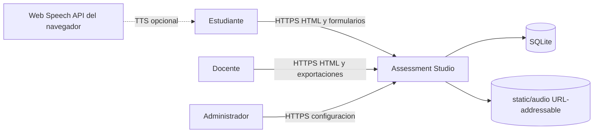
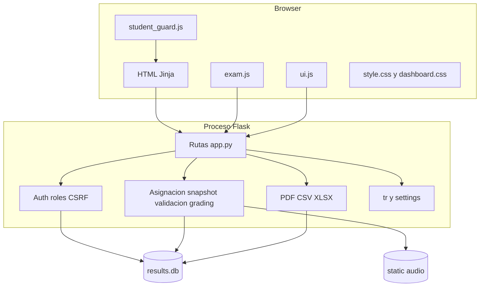
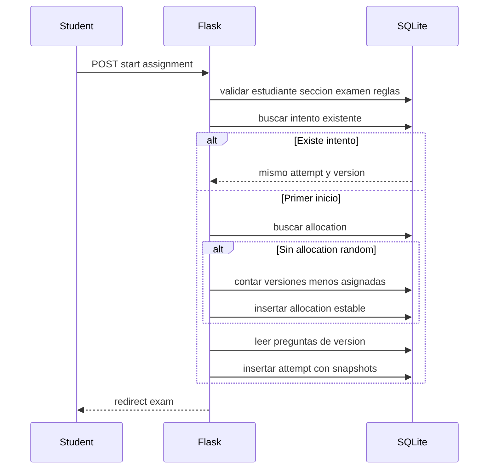
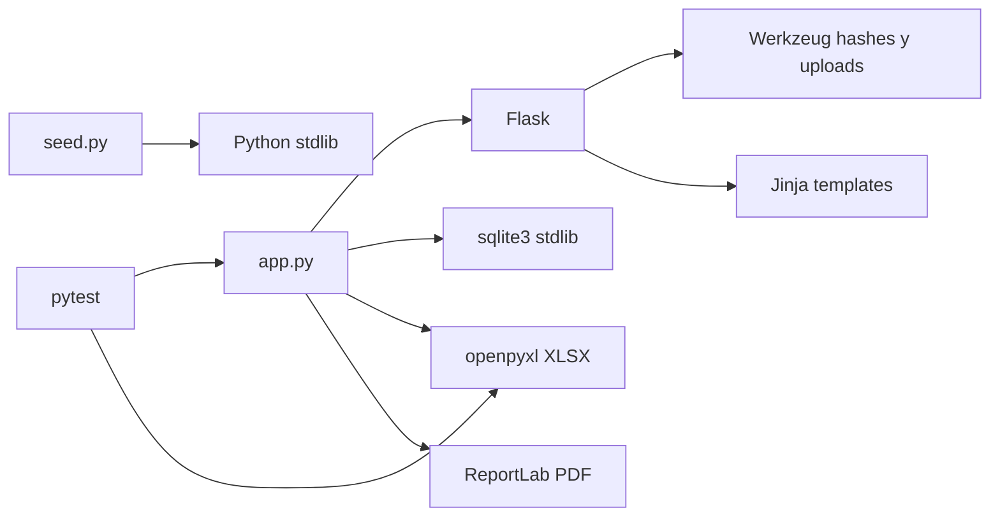

# 05 - Arquitectura técnica

| Campo | Valor |
|---|---|
| Estado | Implementado; topología productiva marcada como recomendada |
| Versión | 1.0 |
| Fecha | 2026-08-16 |
| Decisiones | [ADRs](13-adrs.md) |

## Contexto del sistema

Assessment Studio es un monolito server-rendered. No hay API pública, broker, worker ni servicio de identidad externo. El endpoint JSON de integridad y el endpoint TTS son interfaces internas de la misma aplicación.

## Contenedores y módulos

## Límites de responsabilidad

| Área | Responsabilidad |
|---|---|
| `app.py` | App Flask, esquema/migración, sesiones, auth, autorización, validación, grading, import/export |
| `policy_defaults.py` | Defaults de reglas compartidos por app y seed |
| `seed.py` | Fixtures de desarrollo y esquema dependency-light reejecutable |
| `templates/` | Presentación Jinja; no decide ownership ni respuesta correcta |
| `static/js/exam.js` | Interacción de pregunta, draft local, navegación y telemetría |
| `static/js/ui.js` | Navegación, modales, toasts, confirmaciones y formularios genéricos |
| `static/js/student_guard.js` | Disuasión básica fuera del examen |
| `static/css/` | Layout responsive, tokens y componentes |
| `tests/` | Regresiones unitarias/integración Flask/markup/export |

## Ciclo de request

1. Flask carga/crea la base mediante `init_db()` al importar `app.py`.
2. La ruta obtiene sesión y, cuando corresponde, pasa por `teacher_required` o `admin_required`.
3. Las mutaciones de formularios llaman `verify_csrf()`, salvo los gaps actuales documentados abajo.
4. La ruta vuelve a resolver IDs y ownership en SQLite.
5. Las reglas de negocio se ejecutan en servidor.
6. La respuesta renderiza Jinja, redirige, devuelve JSON o genera archivo.
7. `add_security_headers()` agrega headers y `no-store` a superficies sensibles.

## Autenticación, sesión y CSRF

Flask usa cookie de sesión firmada con `SECRET_KEY`. El login exitoso hace `session.clear()`, establece identidad/rol y genera token CSRF. Las contraseñas se verifican con Werkzeug. Las rutas decoradas con `teacher_required` vuelven a comprobar que la cuenta existe y está activa; `admin_required` incluye esa comprobación.

El dashboard `/teacher` revalida manualmente la cuenta activa. En cambio, `GET /result/<attempt_id>` y `GET /report/<attempt_id>.pdf` no usan `teacher_required`: confían en `teacher_authenticated`/`teacher_id` ya presentes en sesión y comprueban ownership del attempt, pero no vuelven a consultar `teachers.is_active`. Es un gap conocido: una sesión docente desactivada todavía puede leer sus resultados/PDF hasta que pase por una ruta decorada, el dashboard o se invalide la sesión. El hardening recomendado es aplicar revalidación activa común sin perder ownership.

El CSRF usa token aleatorio en sesión y comparación constante para formularios. La norma objetivo es POST+CSRF para toda mutación, pero el estado actual tiene tres excepciones explícitas: el POST de login `/teacher` no verifica token; `/api/integrity-event` acepta JSON sin token y valida sesión/attempt/student/estado/allowlist; `/teacher/logout` verifica CSRF solo cuando `teacher_authenticated` ya está en sesión y, sin esa marca, limpia la sesión sin token. Son gaps de hardening, no cumplimiento pleno de la norma.

## Tenancy docente y padrón compartido

`question_bank.teacher_id`, `exams.teacher_id` y `attempts.teacher_id` son los roots de ownership. Versiones, selecciones y asignaciones heredan ownership desde `exams`. Penalizaciones exigen que `attempts.teacher_id` y `attempt_penalties.teacher_id` coincidan con el docente actual.

`students`, `sections`, `subjects` y `categories` son institucionales. Todos los docentes pueden gestionar el padrón; solo admin modifica catálogo y settings. Cambiar esta frontera requiere migración de autorización y datos.

## Ciclo de examen

### Asignación estable

`choose_assignment_version()` primero busca `student_exam_allocations`. En modo fixed valida la versión. En modo random cuenta allocations por versión usable, toma el mínimo y usa `secrets.choice()` entre empates. `UNIQUE(assignment_id, student_id)` impide cambios posteriores.

### Snapshot

`questions_json` conserva pregunta, answer, datos, categoría, subject y listening source. `exam_version_name`, identidad del estudiante, título/asignatura, labels, idioma y `policy_*` preservan contexto. La vista elimina `answer` y, para TTS, `script`; el servidor conserva ambos para grading/reproducción autorizada.

La compatibilidad legacy de listening es intencional: si `data_json.listening_source` falta, una pregunta con `audio` usa archivo; una pregunta sin audio pero con `script` usa TTS. Una fila legacy script-only sigue siendo usable, se normaliza como TTS al crear/renderizar el snapshot y obtiene el guion solo mediante el endpoint autenticado.

### Frontera de audio

**Implementado:** los uploads se guardan con nombre aleatorio bajo `static/audio` y el HTML usa la URL estática correspondiente. Flask puede servir cualquier archivo de ese directorio sin auth si alguien conoce o descubre su URL; la autorización del intento no protege el fetch del archivo. El nombre aleatorio reduce descubrimiento casual, pero no es control de acceso. El endpoint TTS sí permanece autenticado, attempt/question-scoped y `no-store`.

**Recomendado:** para audio confidencial, mover archivos fuera de `static/` y servirlos mediante un endpoint autenticado, attempt/question-scoped, con autorización y headers de cache; alternativamente usar storage privado con URLs firmadas de corta duración. La implementación actual solo es apropiada para audio no confidencial o donde este riesgo sea aceptado explícitamente.

### Validación y grading

El cliente guía y bloquea saltos hacia delante. El servidor es canónico: `validate_required_answers()` valida contra snapshot; solo después `score_attempt()` califica. En error se guarda draft y el estado sigue `in_progress`. En éxito, un único UPDATE establece scores, answers y `submitted`.

## i18n

`ui_language` global está en `app_settings`. `get_ui_language()` usa el snapshot del intento para student exam/result y el global en otras rutas. `tr()` utiliza keys inglesas y diccionario español. El contenido académico no se traduce.

## Estadísticas

- Student: asignadas, disponibles, en progreso, completadas, completion rate, media ajustada y próximo examen.
- Teacher: resultados enviados, media académica/ajustada, clean/review, eventos agregados, distribución 0-59/60-79/80-100, exámenes, preguntas y padrón.
- Los filtros visibles calculan un resumen separado; KPIs principales usan todos los resultados del owner.

## Integridad y penalizaciones

`exam.js` registra visibility, blur, pagehide, intentos bloqueados y salida de fullscreen. El servidor incrementa contadores y añade `integrity_events`. La vista docente empareja salida/retorno, humaniza tiempos y conserva payload técnico colapsado.

No existe regla automática de descuento. El owner aplica puntos positivos con motivo y límite a la nota ajustada disponible. La revocación marca actor/fecha. `grade10` queda intacta y la proyección es `max(0, grade10 - sum(active points))`.

## Reportes e importaciones

- PDF: ReportLab, intento individual, idioma snapshot, resumen, integridad y motivos activos; sin clave.
- CSV: resultados filtrados, columnas académicas, categorías/tipos e integridad.
- XLSX: hoja Results más Integrity Events, limitada a los attempt IDs filtrados.
- Import: CSV UTF-8 BOM/UTF-8/Latin-1, coma o punto y coma, aliases bilingües; procesamiento por fila.

## Dependencias

## Runtime y despliegue

**Implementado:** `python app.py` escucha `0.0.0.0:$PORT` con servidor de desarrollo Flask; DB y audio son archivos locales. Los archivos bajo `static/audio` son recursos estáticos URL-addressable, no almacenamiento privado.

**Recomendado para producción:** navegador -> reverse proxy TLS -> servidor WSGI con un proceso/estrategia compatible con SQLite -> app -> volumen persistente para DB/audio. No usar el servidor de desarrollo. Consultar [Operaciones](10-operations-runbook.md).
