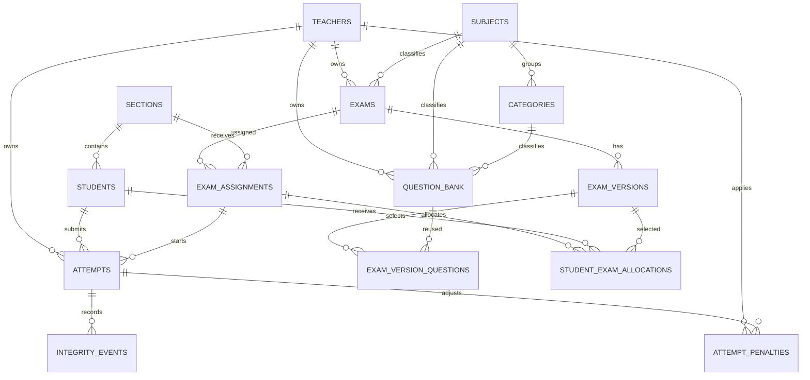

# 06 - Modelo y diccionario de datos

| Campo | Valor |
|---|---|
| Estado | Esquema actual verificado en `init_db()`, `ensure_schema()` y DB local |
| Versión | 1.0 |
| Fecha | 2026-08-16 |
| Archivo por defecto | `data/results.db` |

## Modelo ER

## Diccionario completo

Convenciones: PK = primary key, FK = foreign key declarado cuando el DDL lo incluye, UQ = unique. Los flags son INTEGER 0/1 y timestamps son TEXT ISO sin zona explícita.

### `teachers`

Propósito: identidades admin/docente. Scope institucional; owner root para contenido.

| Columna | Tipo/regla | Significado |
|---|---|---|
| `id` | INTEGER PK | Identificador |
| `full_name` | TEXT NOT NULL | Nombre visible |
| `email` | TEXT NOT NULL UQ NOCASE | Login |
| `password_hash` | TEXT NOT NULL | Hash Werkzeug compatible |
| `role` | TEXT NOT NULL default `teacher` | `admin` o `teacher` por validación de app |
| `is_active` | INTEGER NOT NULL default 1 | Acceso habilitado |
| `must_change_password` | INTEGER NOT NULL default 0 | Reservado; no se fuerza para docentes actualmente |
| `last_login_at` | TEXT nullable | Último login correcto |
| `created_at`, `updated_at` | TEXT NOT NULL | Auditoría básica |

### `sections`

Propósito: grupos compartidos. Columnas: `id` INTEGER PK; `name` TEXT NOT NULL UQ NOCASE; `description` TEXT; `is_archived` INTEGER NOT NULL default 0; `created_at`, `updated_at` TEXT NOT NULL.

### `students`

Propósito: padrón y credenciales compartidas.

| Columna | Tipo/regla | Significado |
|---|---|---|
| `id` | INTEGER PK | Identificador |
| `full_name` | TEXT NOT NULL NOCASE | Nombre; UQ junto con `section_id` |
| `section_id` | INTEGER NOT NULL FK -> `sections.id` | Grupo actual |
| `student_code` | TEXT UQ | NIE/código opcional |
| `email` | TEXT nullable; índice UQ parcial NOCASE | Login; instalaciones legacy pueden tener null |
| `password_hash` | TEXT nullable | Hash; null significa cuenta pendiente legacy |
| `must_change_password` | INTEGER NOT NULL | Fuerza cambio en login |
| `password_updated_at`, `last_login_at` | TEXT nullable | Auditoría de acceso |
| `notes` | TEXT nullable | Nota interna docente |
| `is_active`, `is_archived` | INTEGER NOT NULL | Acceso y archivo lógico |
| `created_at`, `updated_at` | TEXT NOT NULL | Timestamps |

### `subjects`

Propósito: catálogo institucional. Columnas: `id` INTEGER PK; `name` TEXT NOT NULL UQ NOCASE; `description` TEXT; `is_archived` INTEGER NOT NULL default 0; `created_at`, `updated_at` TEXT NOT NULL.

### `categories`

Propósito: clasificación por subject. Columnas: `id` INTEGER PK; `subject_id` INTEGER NOT NULL FK -> `subjects.id`; `name` TEXT NOT NULL NOCASE; `description` TEXT; `sort_order` INTEGER NOT NULL default 0; `is_archived` INTEGER NOT NULL default 0; `created_at`, `updated_at` TEXT NOT NULL; UQ (`subject_id`, `name`).

### `question_bank`

Propósito: contenido reutilizable owned por docente.

| Columna | Tipo/regla | Significado |
|---|---|---|
| `id` | TEXT PK | ID `q_*` o seed |
| `teacher_id` | INTEGER nullable; FK en DDL de app | Owner; legacy se backfillea |
| `subject_id`, `category_id` | INTEGER nullable; FK | Clasificación |
| `type` | TEXT NOT NULL | Uno de siete tipos |
| `prompt` | TEXT NOT NULL | Enunciado |
| `data_json` | TEXT NOT NULL | Choices/items/pairs/source/lang/case sensitivity |
| `answer_json` | TEXT NOT NULL | Respuesta canónica server-side |
| `audio`, `script` | TEXT nullable | Archivo local o guion TTS; en filas legacy sin `listening_source`, audio tiene prioridad y script-only cae a TTS |
| `is_active` | INTEGER NOT NULL default 0 | Flag legacy/de banco; selección real vive en versiones |
| `is_archived` | INTEGER NOT NULL default 0 | Archivo lógico |
| `created_at`, `updated_at` | TEXT NOT NULL | Timestamps |

### `exams`

Propósito: evaluación owned. Columnas: `id` INTEGER PK; `teacher_id` INTEGER nullable (FK en DDL app); `subject_id` INTEGER NOT NULL FK -> `subjects.id`; `title` TEXT NOT NULL; `description` TEXT; `is_published`, `is_archived` INTEGER NOT NULL default 0; `created_at`, `updated_at` TEXT NOT NULL.

### `exam_versions`

Propósito: versión nombrada de un examen. Columnas: `id` INTEGER PK; `exam_id` INTEGER NOT NULL FK -> `exams.id`; `name` TEXT NOT NULL; `is_active` INTEGER NOT NULL default 1 (archivo de versión); `created_at`, `updated_at` TEXT NOT NULL; UQ (`exam_id`, `name`).

### `exam_version_questions`

Propósito: M:N ordenada. Columnas: `version_id` INTEGER PK/FK -> `exam_versions.id` con `ON DELETE CASCADE`; `question_id` TEXT PK/FK -> `question_bank.id`; `position` INTEGER NOT NULL default 0. PK compuesta (`version_id`, `question_id`).

### `exam_assignments`

Propósito: asignación de examen a sección. Columnas: `id` INTEGER PK; `exam_id` INTEGER NOT NULL FK; `section_id` INTEGER NOT NULL FK; `version_mode` TEXT NOT NULL default `random`; `fixed_version_id` INTEGER nullable FK; `is_active` INTEGER NOT NULL default 1; `created_at`, `updated_at` TEXT NOT NULL; UQ (`exam_id`, `section_id`). La app limita mode a `random`/`fixed`.

### `student_exam_allocations`

Propósito: versión persistente por estudiante/asignación. Columnas: `id` INTEGER PK; `assignment_id` INTEGER NOT NULL FK; `student_id` INTEGER NOT NULL FK; `version_id` INTEGER NOT NULL FK; `allocated_at` TEXT NOT NULL; UQ (`assignment_id`, `student_id`).

### `attempts`

Propósito: intento y snapshot histórico. El DDL no declara todas las FKs para compatibilidad legacy; la app valida relaciones.

| Grupo | Columnas y significado |
|---|---|
| Identidad | `id` TEXT PK; `teacher_id` owner; `student_id`; `student_email`; `student_name` NOT NULL; `section` NOT NULL |
| Tiempo/estado | `started_at` NOT NULL; `submitted_at`; `status` NOT NULL default `in_progress`; `seed` INTEGER NOT NULL |
| Nota raw | `score`, `total`, `percentage`, `grade10` REAL |
| Respuestas | `category_scores`, `type_scores`, `answers_json` TEXT JSON |
| Integridad agregada | `focus_departures`, `focus_returns`, `blur_events`, `pagehide_events`, `context_menu_attempts`, `copy_attempts`, `cut_attempts`, `paste_attempts`, `shortcut_attempts`, `fullscreen_exits` INTEGER NOT NULL default 0 |
| Ausencia | `away_seconds`, `longest_away_seconds` REAL NOT NULL default 0; `last_security_event_at` TEXT |
| Snapshot académico | `questions_json`, `assessment_title`, `assessment_subject`, `category_labels_json`, `ui_language` TEXT |
| Identidad de examen | `exam_id`, `exam_version_id`, `assignment_id` INTEGER; `exam_version_name` TEXT |
| Política | `policy_version`, `policy_accepted_at`, `policy_text` TEXT |

Índice parcial crítico: UQ (`student_id`, `assignment_id`) cuando `assignment_id IS NOT NULL`.

### `integrity_events`

Propósito: timeline técnica. Columnas: `id` INTEGER PK; `attempt_id` TEXT NOT NULL FK -> `attempts.id`; `event_type` TEXT NOT NULL; `occurred_at` TEXT NOT NULL; `detail_json` TEXT. Allowlist actual: `visibility_hidden`, `focus_return`, `window_blur`, `pagehide`, `contextmenu`, `copy`, `cut`, `paste`, `shortcut`, `fullscreen_exit`.

### `attempt_penalties`

Propósito: deducciones manuales auditables. Columnas: `id` INTEGER PK; `attempt_id` TEXT NOT NULL FK; `teacher_id` INTEGER NOT NULL FK; `points` REAL NOT NULL CHECK >0; `reason` TEXT NOT NULL; `created_at` TEXT NOT NULL; `revoked_at` TEXT; `revoked_by` INTEGER FK -> `teachers.id`; `is_active` INTEGER NOT NULL default 1.

### `app_settings`

Propósito: key-value institucional. Columnas: `key` TEXT PK; `value` TEXT NOT NULL. Referencia completa en [Configuración](14-glossary-governance-roadmap.md#referencia-de-settings).

## Índices

| Índice | Columnas/condición | Objetivo |
|---|---|---|
| `idx_attempt_once_per_assignment` | UQ `attempts(student_id, assignment_id)` non-null | Un intento |
| `idx_students_email_unique` | UQ NOCASE email no vacío | Login único |
| `idx_teachers_active` | `is_active, role, full_name` | Gestión docente |
| `idx_question_bank_teacher` | `teacher_id, subject_id, is_archived` | Tenancy banco |
| `idx_exams_teacher` | `teacher_id, subject_id/is_published, is_archived` según initializer | Tenancy exámenes |
| `idx_attempts_teacher` | `teacher_id, status, submitted_at` | Dashboard/export |
| `idx_integrity_attempt` | `attempt_id` | Timeline |
| `idx_attempt_penalties_active` | `attempt_id, is_active` | Nota ajustada |
| `idx_attempt_penalties_teacher` | `teacher_id, created_at` | Auditoría owner |
| Otros | categories, students, exams, versions, assignments, question active/type | Listados y filtros |

## Ownership y comportamiento histórico

| Datos | Scope | Archivo/historia |
|---|---|---|
| Teachers/settings/catalog/padrón | Institucional | Flags conservan registros; cambios de nombre no reescriben snapshots |
| Question bank/exams/attempts | `teacher_id` | Preguntas/exámenes se archivan; intento conserva contexto |
| Versiones | Heredado de exam | `is_active=0`; restaurables |
| Asignaciones | Heredado de exam | Desactivación no elimina intento/allocation |
| Penalizaciones | Owner del attempt | Revocación lógica, no borrado |

## Migraciones y compatibilidad

`init_db()` crea tablas, inspecciona `PRAGMA table_info`, añade columnas faltantes y backfillea `teacher_id` null al primer/bootstrap teacher. También migra columnas de una edición English legacy y settings antiguos. La compatibilidad de datos conserva listening legacy sin `data_json.listening_source`: `audio` implica fuente de archivo y una fila script-only implica TTS; no se debe exigir una migración destructiva para esas filas. No existe herramienta de versionado ni rollback automático.

**Discrepancia verificada:** `seed.py:ensure_schema()` mantiene paridad de tablas/columnas, pero su DDL inicial no declara FK `teacher_id` en `question_bank`/`exams`, y usa default 0 para `students.must_change_password` frente a default 1 en `app.py`. SQLite `ALTER TABLE ADD COLUMN` no añade FKs retroactivas. La app mantiene ownership y validación como autoridad, pero se recomienda alinear ambos DDL en un cambio de código probado.

## Retención y respaldo

**Recomendado:** respaldar conjuntamente DB y `static/audio`, cifrar copias, definir RPO/RTO, comprobar `PRAGMA integrity_check`, probar restauración y documentar retención de intentos/telemetría. La aplicación no elimina automáticamente datos históricos ni implementa legal hold/anonymization.
