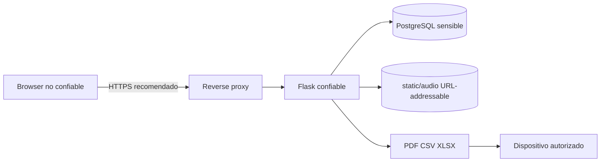
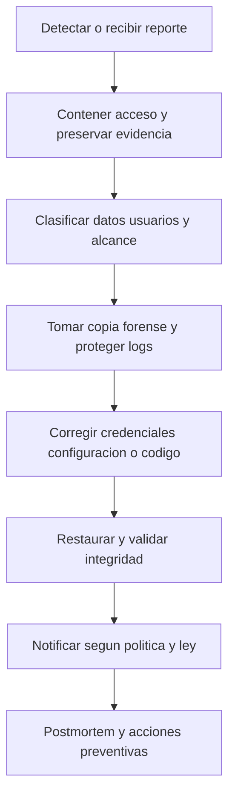

# 07 - Seguridad y privacidad

| Campo | Valor |
|---|---|
| Estado | Controles implementados y recomendaciones separados |
| Versión | 1.0 |
| Fecha | 2026-08-16 |

## Propiedades de seguridad

- Contraseñas hasheadas, nunca recuperables en texto plano.
- Sesiones firmadas, CSRF en la mayoría de formularios de mutación y autorización server-side; excepciones actuales documentadas abajo.
- Ownership docente y ownership estudiantil revalidados en rutas sensibles.
- Preguntas del navegador sin `answer`; TTS script fuera del HTML inicial.
- Intento único, versión estable y snapshot histórico.
- Telemetría como indicador, no prueba; penalización exclusivamente manual y auditable.

## Límites de confianza

Todo dato del browser, incluidos IDs, respuestas, contadores, filenames y payloads de telemetría, es no confiable. El reverse proxy no existe en el runtime de desarrollo actual; es una frontera recomendada en producción. Aunque el contenido de audio puede ser sensible, el almacenamiento actual no es privado: cualquier archivo bajo `static/audio` puede solicitarse sin sesión si se conoce su URL.

## Activos

- Identidad, correo, código y sección de estudiantes.
- Hashes de docentes/estudiantes.
- Preguntas, claves, scripts y audio.
- Intentos, respuestas, notas y snapshots de reglas.
- Eventos de integridad y motivos de penalización.
- `SECRET_KEY`, DB, audio, backups y exportaciones.

## Modelo de amenazas

| Amenaza | Riesgo | Control actual | Brecha/recomendación |
|---|---|---|---|
| Fuerza bruta | Acceso no autorizado | Hash + mensaje genérico | Rate limiting, alertas y lockout progresivo |
| Robo de sesión | Suplantación | Cookie firmada; `session.clear()`; `Secure` por default; `HttpOnly`; `SameSite=Lax` | Servir por TLS, rotar `SECRET_KEY` y definir expiración explícita |
| CSRF | Mutación con sesión ajena | Tokens en la mayoría de formularios | Corregir login docente sin token, API JSON de integridad sin token y logout docente condicional |
| IDOR | Leer/modificar otro tenant | Queries con owner/parent | Mantener pruebas negativas por cada nested route |
| SQL injection | Lectura/escritura arbitraria | Parámetros psycopg `%s`; fragmentos dinámicos derivados de allowlists | Prohibir concatenar input sin allowlist |
| XSS almacenado/reflejado | Robo de sesión/datos | Autoescape Jinja; JSON con `tojson` | Evitar `safe`; revisar export/PDF y CSP |
| Upload malicioso | Ejecución/DoS | Extensiones allowlist, `secure_filename`, tamaño total 20MB, nombre aleatorio | Validar MIME/magic bytes, cuota y antivirus según riesgo |
| Audio estático conocido | Lectura no autorizada de listening | Nombre de upload aleatorio | `static/audio` no exige auth; mover fuera de static y servir con endpoint autorizado o URL firmada |
| CSV formula injection | Ejecución al abrir export | No mitigado explícitamente | Neutralizar celdas iniciadas por `= + - @` en exports/imports |
| Exposición de answers | Compromiso académico | `clean_question()` omite answer | Prueba de HTML por todos los tipos |
| Exposición TTS | Guion visible antes de tiempo | Endpoint session/attempt/question scoped, `no-store` | El texto llega al browser al reproducir; no prometer secreto absoluto |
| Bypass de un intento | Repetición | Índice unique + lookup | Mantener backup/migrations sin perder índice |
| Alteración de telemetría | Evidencia falsa/incompleta | Server allowlist y ownership | Browser es manipulable; señal no es prueba |
| Penalización injusta | Daño académico | Motivo, owner, cap, revocación, raw intacto | Proceso de apelación y política institucional |
| Pérdida/ransomware | Indisponibilidad | Ningún backup automático | Backups cifrados, offline y restore drills |
| Cross-tenant export | Fuga masiva | `teacher_id` y filtered attempt IDs | Pruebas para CSV, XLSX sheets y PDF |

## OWASP y controles

### Autenticación y secretos

Werkzeug genera/verifica hashes. `seed.py` genera PBKDF2 compatible para no depender de Flask. Las claves mínimas requieren 8-128 caracteres, una letra y un número. Los defaults de `.env.example` y credenciales seed son solo desarrollo.

**Producción:** definir `SECRET_KEY` aleatoria larga, bootstrap admin no demo, TLS, política de rotación y almacenamiento de secretos fuera del repositorio. No usar `FLASK_DEBUG=1`.

### Autorización y tenancy

`teacher_required` comprueba cuenta activa. `admin_required` añade rol. Los contenidos nested se resuelven desde `exam_row()` owned. El resultado/PDF permite student owner o teacher owner; su rama docente revalida `teachers.is_active`, limpia la sesión si la cuenta fue desactivada y mantiene el filtro de ownership. Admin no tiene bypass para penalizaciones/resultados ajenos.

### CSRF y métodos

La norma del proyecto exige POST+CSRF para mutaciones. La mayoría de formularios cumple y las rutas GET son de lectura/generación de archivos. Excepciones actuales: el POST de login `/teacher` no verifica CSRF; `/api/integrity-event` muta mediante JSON autenticado sin token; `/teacher/logout` solo verifica el token si `teacher_authenticated` ya está presente, y de otro modo limpia sesión sin token. Los formularios GET/POST de clave/setup mutan solo en POST y sí verifican token.

### Input, uploads e imports

- Emails se normalizan y limitan.
- Strings tienen límites server-side en rutas principales.
- CSV limita upload global a 20MB, extensión `.csv`, encoding y headers.
- Filas inválidas/duplicadas se omiten y reportan; no sobrescriben silenciosamente.
- Audio permite WAV/MP3/M4A/OGG/AAC por extensión y se renombra aleatoriamente.
- El nombre aleatorio de audio no sustituye autorización: `static/audio` sigue siendo URL-addressable sin sesión.
- IDs nunca se confían sin consulta posterior.

### XSS, CSP y headers

Jinja autoescapa HTML. `tojson` serializa diccionarios JS. Headers: `X-Content-Type-Options: nosniff`, `X-Frame-Options: DENY`, `Referrer-Policy: no-referrer`, Permissions Policy restrictiva y CSP. La CSP permite inline script/style y `cdn.jsdelivr.net`, por lo que no es estricta contra XSS; SweetAlert2 tiene fallback nativo.

### Privacidad estudiantil

Los datos incluyen PII, desempeño y telemetría conductual. La vista student no muestra timeline/raw payload; solo resumen. Exports y backups amplifican el riesgo de fuga. La institución debe aplicar mínimo privilegio, retención, cifrado, control de descargas y proceso de acceso/corrección.

## Integridad académica y equidad

Los bloqueos de copiar, menú contextual, atajos, fullscreen y visibility son disuasión de navegador. No detectan otro dispositivo, captura externa, browser modificado ni toda pérdida de foco. También pueden registrar eventos legítimos por accesibilidad, notificaciones, selectores nativos o fallos del dispositivo.

**Norma obligatoria:** la telemetría es un indicador técnico, no prueba de conducta indebida. Ningún evento descuenta puntos automáticamente. Solo el docente owner puede aplicar una penalización manual con motivo; queda auditable y revocable, y la nota académica original no cambia.

## Checklist de seguridad

### Antes de producción

- [ ] Cambiar `SECRET_KEY` y credenciales bootstrap.
- [ ] Servir solo por TLS y mantener `SESSION_COOKIE_SECURE=1`; el override `0` es exclusivo de HTTP local aislado.
- [ ] Ejecutar con WSGI, no servidor Flask de desarrollo.
- [ ] Restringir permisos de DB, audio, logs y backups.
- [ ] Para audio confidencial, mover uploads fuera de `static/` y servirlos mediante autorización attempt/question o URLs firmadas breves.
- [ ] Configurar rate limiting en login.
- [ ] Validar MIME real de audio y política antivirus/cuota.
- [ ] Mitigar CSV formula injection.
- [ ] Revisar CSP sin `unsafe-inline` cuando sea viable.
- [ ] Definir retención, aviso de privacidad y apelación de penalizaciones.
- [ ] Probar tenant isolation y restauración.

### En cada release

- [ ] Verificar que HTML inicial no contiene answers/scripts.
- [ ] Ejecutar tests, py_compile y node checks.
- [ ] Revisar rutas nuevas por método, CSRF, rol y ownership.
- [ ] Revisar migraciones e índices críticos.
- [ ] Revisar dependencies y changelog.

## Respuesta a incidentes

No borrar eventos ni penalizaciones durante una investigación sin autorización institucional. Rotar `SECRET_KEY` invalida sesiones existentes y debe coordinarse. El runbook operativo está en [10 - Operaciones](10-operations-runbook.md#respuesta-a-incidentes).
