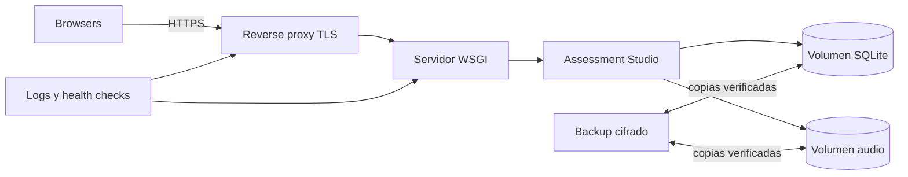
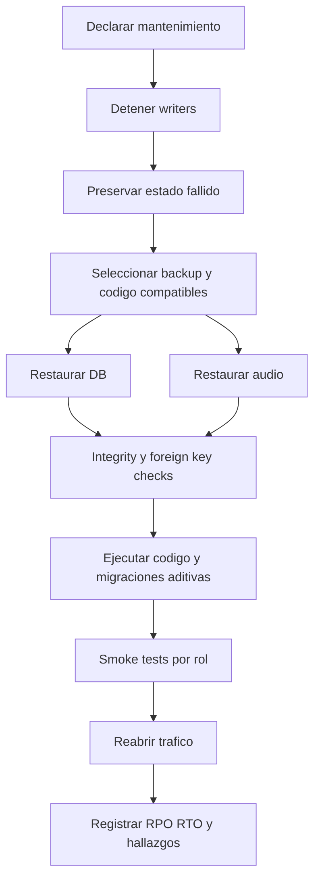

# 10 - Operaciones y despliegue

| Campo | Valor |
|---|---|
| Estado | Runtime actual implementado; producción recomendada |
| Versión | 1.0 |
| Fecha | 2026-08-16 |

## Runtime actual

**Implementado:** `python app.py` ejecuta el servidor de desarrollo Flask en `0.0.0.0:$PORT`. SQLite reside en `DATABASE_PATH` o `data/results.db`; audio en `static/audio`; CSS/JS/iconos son estáticos locales, excepto SweetAlert2 opcional desde CDN. Todo archivo de `static/audio` es URL-addressable sin autenticación si se conoce su nombre; el storage actual no ofrece confidencialidad por sesión/attempt.

Este runtime es apropiado para desarrollo, no para producción.

## Topología recomendada

### Recomendaciones

- Reverse proxy Nginx/Caddy/Apache con TLS, límites y headers.
- WSGI como Gunicorn/Waitress según plataforma; validar estrategia de workers con SQLite.
- Un volumen persistente con permisos mínimos para DB y audio.
- Static servido por proxy o Flask según escala, preservando CSP. Esto mantiene público `static/audio`; no delegar ese directorio al static server si el audio debe ser confidencial.
- Para audio confidencial, almacenarlo fuera de `static/` y entregarlo mediante endpoint Flask autorizado por sesión/attempt/question, o storage privado con URLs firmadas breves.
- Un solo proceso escritor como baseline prudente; no escalar horizontalmente con DB local compartida sin rediseño.

## Configuración y secretos

- Definir `SECRET_KEY`, bootstrap admin y `DATABASE_PATH` desde secret manager/systemd/container env.
- `FLASK_DEBUG=0` en producción.
- No registrar contraseñas, cookies, answers, scripts o payloads sensibles completos.
- Configurar cookie `Secure`, `HttpOnly`, `SameSite` y vida de sesión explícita en código/config antes de producción.
- Cambiar bootstrap defaults antes del primer inicio; después se usan cuentas persistidas.
- No exponer el primer startup a red: configurar `SECRET_KEY`, `TEACHER_ADMIN_NAME`, `TEACHER_ADMIN_EMAIL` y `TEACHER_ADMIN_PASSWORD` antes de importar la app y usar loopback hasta completar hardening.

## Permisos y almacenamiento

| Recurso | Recomendación |
|---|---|
| DB | Usuario de servicio: read/write; otros: sin acceso |
| Directorio DB | write para journal/locks y reemplazo de restore |
| Audio actual | write para app, read para servicio web; sin ejecución; URL pública si se conoce |
| Audio confidencial recomendado | Fuera de `static`; read solo mediante app/storage privado después de autorización |
| Código/static icons | read-only en runtime |
| Backups | cifrados, cuenta separada, copia offline/immutable |
| Exports | No persistir en servidor; controlar destino del usuario |

## Health checks

**Implementado:** no hay endpoint `/health` dedicado.

**Recomendado:** health interno que compruebe proceso y `SELECT 1`, sin exponer schema/config. Readiness debe fallar si DB no abre; liveness no debería ejecutar migraciones. Monitorear además espacio en disco, latencia, errores 5xx, locks SQLite y éxito de backup.

## Logging y monitoreo

La app usa logging Flask principalmente para excepciones puntuales; no hay formato estructurado ni auditoría administrativa completa.

Recomendado registrar: timestamp UTC, request ID, route, status, duración, actor ID pseudonimizado, error class y eventos operativos. No registrar passwords, cookies, answer keys, policy text completo ni PII innecesaria.

Alertas mínimas: picos 401/403/429/5xx, `database is locked`, fallo de backup, disco >80%, restore drill vencido y cambios de configuración/roles.

## Capacidad y concurrencia SQLite

SQLite permite múltiples lecturas pero serializa escrituras. Starts, telemetría frecuente, submissions e imports compiten por write locks. No existe `busy_timeout`, WAL explícito, pooling ni benchmark en el código actual.

**Supuesto operativo:** institución pequeña con concurrencia moderada. Antes de ampliar, ejecutar carga realista con eventos de integridad, importaciones y submit simultáneos. Si los locks/latencia exceden objetivos, migrar a PostgreSQL mediante plan explícito; no montar SQLite en filesystem de red no compatible.

## Backup

### Alcance

Respaldar juntos:

- `data/results.db` o `DATABASE_PATH`;
- `static/audio/` excluyendo solo assets regenerables claramente identificados;
- configuración de servicio/reverse proxy y secretos mediante su sistema seguro;
- versión exacta del código desplegado.

### Procedimiento recomendado

1. Registrar fecha, versión y responsable.
2. Reducir/pausar escrituras o usar API de backup SQLite consistente.
3. Crear copia de DB sin copiar un archivo activo de forma insegura.
4. Copiar audio y manifiesto de hashes.
5. Cifrar y transferir a destino separado.
6. Verificar apertura, `PRAGMA integrity_check`, `PRAGMA foreign_key_check` y conteos básicos.
7. Probar restauración periódica en entorno aislado.

## Restauración

No sobrescribir el estado fallido sin copia forense. Validar admin/teacher/student, allocation estable, resultado/PDF y audio.

El restore debe conservar nombres y referencias de audio, pero no debe reabrir tráfico confidencial mientras los archivos sigan públicamente servidos desde `static/audio`. Verificar con una solicitud sin sesión: en el estado actual una URL conocida responde; una futura migración a media privada debe negar esa solicitud y permitir solo el intento autorizado.

## Upgrade y rollback

### Upgrade

1. Leer changelog y migración.
2. Ejecutar tests en copia de producción anonimizada cuando sea legal.
3. Respaldar DB/audio y verificar restore.
4. Detener escrituras.
5. Desplegar código/dependencias.
6. Iniciar una vez para `init_db()`.
7. Ejecutar checks de integridad y smoke tests.
8. Abrir tráfico y monitorear.

### Rollback

No asumir que código anterior entiende columnas/semántica nuevas. Si el cambio fue solo aditivo y compatible, volver a binario anterior puede ser viable. Para cambio de datos, restaurar backup completo y aceptar el RPO documentado. Toda migración destructiva necesita plan dedicado previo.

## Respuesta a incidentes

1. Abrir incidente, asignar owner y severidad.
2. Contener: retirar tráfico, desactivar cuenta, rotar secreto o aislar host según caso.
3. Preservar DB, audio, logs y tiempos; no alterar evidencia académica.
4. Si el incidente involucra una URL de audio conocida, retirar temporalmente el static afectado o el tráfico completo: desactivar una cuenta no revoca acceso a `static/audio`.
5. Determinar instituciones/usuarios/datos/rutas afectados.
6. Corregir y validar en entorno aislado.
7. Restaurar con runbook y smoke tests.
8. Notificar según política/ley y comunicar limitaciones.
9. Documentar causa, timeline, impacto y acciones.

En controversias de integridad, conservar telemetría y penalty audit, recordar que son indicadores y activar revisión humana/apelación.

## Mantenimiento

- Diario: alertas, disco, errores y backup status.
- Semanal: login/submit/export smoke, revisión de locks y cuentas inactivas.
- Mensual: dependencias, restore sample, permisos y capacidad.
- Trimestral: restore completo, threat model, accesibilidad/browser matrix y retención.
- Antes de periodo de exámenes: prueba de carga, versiones/asignaciones, audio/TTS y soporte.

## Checklist de release

- [ ] [Gates de calidad](09-quality-strategy.md#gates-de-release) satisfechos.
- [ ] Backup y restauración verificados.
- [ ] Config/secrets/cookies/TLS revisados.
- [ ] Migración y rollback documentados.
- [ ] Storage suficiente para DB/audio.
- [ ] Smoke admin, teacher owner, second teacher y student.
- [ ] Start/resume/submit/result/export probados.
- [ ] Monitoreo activo y responsable de guardia definido.
- [ ] Documentación/changelog publicados con la versión.
