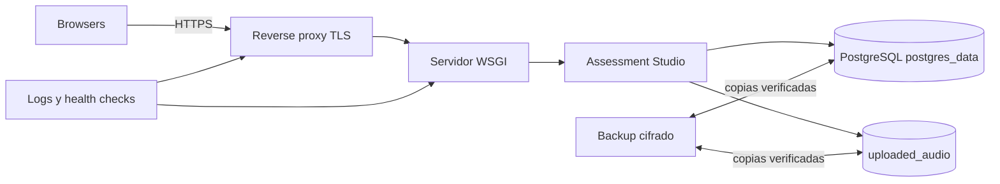
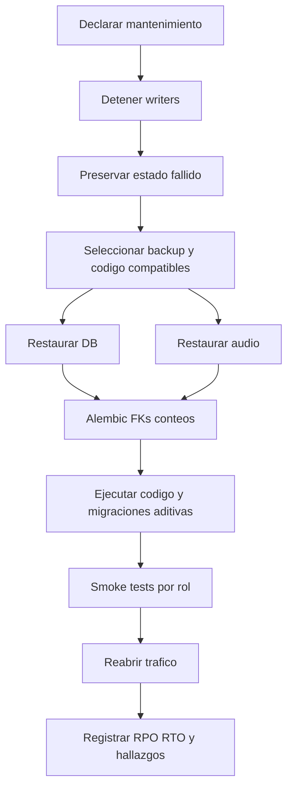

# 10 - Operaciones y despliegue

| Campo | Valor |
|---|---|
| Estado | Runtime PostgreSQL + Docker Compose + Gunicorn implementado |
| Versión | 2.0 |
| Fecha | 2026-08-16 |

## Runtime actual

**Implementado:** `compose.yaml` levanta `app` y PostgreSQL 17. La DB no publica puerto. `docker-entrypoint.sh` ejecuta `alembic upgrade head` con retry acotado ante la transición inicial de PostgreSQL, `bootstrap.py` y luego Gunicorn. Un error persistente de migración detiene el contenedor. `postgres_data` persiste DB y `uploaded_audio` persiste `/app/static/audio`. Todo audio sigue siendo URL-addressable si se conoce el nombre; persistencia no cambia esa frontera de confidencialidad.

```bash
cp .env.example .env
# Reemplazar todos los secretos placeholder.
docker compose config --quiet
docker compose up -d --build --wait
docker compose ps
docker compose logs app db
```

Para inspección sin publicar PostgreSQL: `docker compose exec db psql -U "$POSTGRES_USER" -d "$POSTGRES_DB"`. Para detener conservando datos: `docker compose down`. No usar `docker compose down -v` salvo eliminación deliberada y autorizada de ambos volúmenes. El puerto de la app se publica en `127.0.0.1` por default mediante `APP_BIND_IP`; exponer otra interfaz requiere una decisión explícita y el proxy/firewall correspondiente.

## Topología implementada



### Producción

- Reverse proxy Nginx/Caddy/Apache con TLS, límites y headers.
- Mantener `SESSION_COOKIE_SECURE=1` detrás de TLS. El valor `0` de `.env.example` existe exclusivamente para probar por HTTP en loopback y no debe llegar a producción.
- Gunicorn ya está incluido; ajustar workers/threads contra CPU, RAM y límite de conexiones.
- Mantener volúmenes con permisos mínimos y backups externos verificados.
- Static servido por proxy o Flask según escala, preservando CSP. Esto mantiene público `static/audio`; no delegar ese directorio al static server si el audio debe ser confidencial.
- Para audio confidencial, almacenarlo fuera de `static/` y entregarlo mediante endpoint Flask autorizado por sesión/attempt/question, o storage privado con URLs firmadas breves.
- Se permiten múltiples workers; cada proceso tiene su propio pool acotado. La suma `réplicas × workers × DB_POOL_MAX_SIZE` debe caber en `max_connections` dejando margen operativo.

## Configuración y secretos

- Definir `SECRET_KEY`, bootstrap admin, `POSTGRES_PASSWORD` y `DATABASE_URL` desde secret manager/container env.
- Tratar `POSTGRES_PASSWORD` como valor raw del contenedor y `DATABASE_URL` como una URI independiente. Percent-encodear caracteres reservados de la contraseña al construir la URI; Compose no interpola el password raw y rechaza un `DATABASE_URL` ausente.
- `FLASK_DEBUG=0` en producción.
- No registrar contraseñas, cookies, answers, scripts o payloads sensibles completos.
- La app configura `Secure` por default, `HttpOnly` siempre y `SameSite=Lax` por default; revisar esos valores y la vida de sesión para la topología productiva.
- Cambiar bootstrap defaults antes del primer inicio; después se usan cuentas persistidas.
- Configurar `TEACHER_ADMIN_NAME`, `TEACHER_ADMIN_EMAIL` y `TEACHER_ADMIN_PASSWORD` antes del primer bootstrap. El entrypoint rechaza variables obligatorias ausentes.

## Permisos y almacenamiento

| Recurso | Recomendación |
|---|---|
| DB | Usuario de aplicación: privilegios sobre schema/tablas; PostgreSQL sin puerto público en Compose |
| `postgres_data` | Persistencia del cluster; no editar archivos directamente |
| Audio actual | write para app, read para servicio web; sin ejecución; URL pública si se conoce |
| Audio confidencial recomendado | Fuera de `static`; read solo mediante app/storage privado después de autorización |
| Código/static icons | read-only en runtime |
| Backups | cifrados, cuenta separada, copia offline/immutable |
| Exports | No persistir en servidor; controlar destino del usuario |

## Health checks

**Implementado:** `GET /health/live` responde si Flask está vivo. `GET /health/ready` ejecuta `SELECT 1`; devuelve 503 si PostgreSQL no está disponible y nunca ejecuta migraciones. Compose usa `pg_isready` para DB y readiness HTTP para app.

Monitorear además latencia, errores 5xx, saturación del pool, conexiones PostgreSQL, locks/deadlocks, volumen/disco y éxito de backup.

## Logging y monitoreo

La app usa logging Flask principalmente para excepciones puntuales; no hay formato estructurado ni auditoría administrativa completa.

Recomendado registrar: timestamp UTC, request ID, route, status, duración, actor ID pseudonimizado, error class y eventos operativos. No registrar passwords, cookies, answer keys, policy text completo ni PII innecesaria.

Alertas mínimas: picos 401/403/429/5xx, pool timeout, deadlocks, conexiones >80%, fallo de backup, disco >80%, restore drill vencido y cambios de configuración/roles.

## Capacidad y concurrencia PostgreSQL

**Implementado:** psycopg 3 usa un pool por proceso (`DB_POOL_MIN_SIZE=1`, `DB_POOL_MAX_SIZE=10`, `DB_POOL_TIMEOUT=10`). Start bloquea solo la fila de assignment durante allocation+snapshot; submit e integridad bloquean solo su attempt. Las transacciones permanecen cortas y los índices de unicidad son la última defensa.

**Recomendado:** comenzar con `GUNICORN_WORKERS=2`, `GUNICORN_THREADS=4`, pool máximo 10 y medir. No aumentar workers/pool sin calcular conexiones. Ejecutar carga con proporción realista de login/start, eventos, submit, dashboard y exports; medir p50/p95/p99, errores, espera de pool, locks, CPU/IO, crecimiento de WAL y tamaño de snapshots. Definir SLO institucional antes de aprobar escala.

## Backup

### Alcance

Respaldar juntos:

- dump lógico PostgreSQL (`pg_dump` custom format);
- `static/audio/` excluyendo solo assets regenerables claramente identificados;
- configuración de servicio/reverse proxy y secretos mediante su sistema seguro;
- versión exacta del código desplegado.

### Procedimiento recomendado

1. Registrar fecha, versión y responsable.
2. Ejecutar `pg_dump --format=custom --no-owner --file assessment.dump "$DATABASE_URL"` con credenciales de backup.
3. Registrar checksum y versión PostgreSQL/Alembic.
4. Copiar audio y manifiesto de hashes.
5. Cifrar y transferir a destino separado.
6. Verificar `pg_restore --list`, restaurar en una DB aislada y comprobar Alembic/FKs/conteos/smokes.
7. Probar restauración periódica en entorno aislado.

## Restauración



No sobrescribir el estado fallido sin copia forense. Crear DB vacía, restaurar con `createdb` + `pg_restore --clean --if-exists --no-owner --dbname ... assessment.dump`, restaurar audio, comprobar `alembic current`, health y smokes de admin/teacher/student/allocation/result/PDF/audio.

El restore debe conservar nombres y referencias de audio, pero no debe reabrir tráfico confidencial mientras los archivos sigan públicamente servidos desde `static/audio`. Verificar con una solicitud sin sesión: en el estado actual una URL conocida responde; una futura migración a media privada debe negar esa solicitud y permitir solo el intento autorizado.

## Upgrade y rollback

### Upgrade

1. Leer changelog y migración.
2. Ejecutar tests en copia de producción anonimizada cuando sea legal.
3. Respaldar DB/audio y verificar restore.
4. Detener escrituras.
5. Desplegar código/dependencias.
6. Ejecutar `alembic upgrade head` y `python bootstrap.py` antes de Gunicorn (el entrypoint lo hace).
7. Comprobar `/health/live`, `/health/ready`, versión Alembic y smoke tests.
8. Abrir tráfico y monitorear.

### Rollback

No asumir que código anterior entiende schema nuevo. Usar downgrade Alembic solo si fue ensayado y declarado seguro; en otro caso restaurar dump+audio compatibles y aceptar el RPO. Toda migración destructiva necesita plan dedicado previo.

## Respuesta a incidentes

1. Abrir incidente, asignar owner y severidad.
2. Contener: retirar tráfico, desactivar cuenta, rotar secreto o aislar host según caso.
3. Preservar DB, audio, logs y tiempos; no alterar evidencia académica.
4. Si el incidente involucra una URL de audio conocida, retirar temporalmente el static afectado o el tráfico completo: desactivar una cuenta no revoca acceso a `static/audio`.
5. Determinar instituciones/usuarios/datos/rutas afectados.
6. Corregir y validar en entorno aislado.
7. Restaurar con runbook y smoke tests.
8. Notificar según política/ley y comunicar limitaciones.
9. Documentar causa, timeline, impacto y acciones.

En controversias de integridad, conservar telemetría y penalty audit, recordar que son indicadores y activar revisión humana/apelación.

## Mantenimiento

- Diario: alertas, disco, errores y backup status.
- Semanal: login/submit/export smoke, revisión de locks y cuentas inactivas.
- Mensual: dependencias, restore sample, permisos y capacidad.
- Trimestral: restore completo, threat model, accesibilidad/browser matrix y retención.
- Antes de periodo de exámenes: prueba de carga, versiones/asignaciones, audio/TTS y soporte.

## Checklist de release

- [ ] [Gates de calidad](09-quality-strategy.md#gates-de-release) satisfechos.
- [ ] Backup y restauración verificados.
- [ ] Config/secrets/cookies/TLS revisados.
- [ ] Migración y rollback documentados.
- [ ] Storage suficiente para DB/audio.
- [ ] Smoke admin, teacher owner, second teacher y student.
- [ ] Start/resume/submit/result/export probados.
- [ ] Monitoreo activo y responsable de guardia definido.
- [ ] Documentación/changelog publicados con la versión.
