# 12 - Catálogo de diagramas

| Campo | Valor |
|---|---|
| Estado | Implementado/recomendado según cada leyenda |
| Versión | 1.0 |
| Fecha | 2026-08-16 |

Los IDs y labels evitan caracteres Mermaid ambiguos. Diagramas adicionales: [contexto y módulos](05-architecture.md), [ER](06-data-model.md), [UX](04-ux-design-system.md), [deploy/restore](10-operations-runbook.md) y [threat boundaries](07-security-privacy.md).

## Inventario

| ID | Diagrama | Tipo | Estado descrito |
|---|---|---|---|
| D01 | Contexto | Flowchart | Implementado |
| D02 | Contenedores y módulos | Flowchart | Implementado |
| D03 | Datos ER principal | ER | Implementado; relaciones principales completas |
| D04 | Login docente | Sequence | Implementado |
| D05 | Login estudiante y reglas | Sequence | Implementado |
| D06 | Asignación, allocation y snapshot | Sequence | Implementado |
| D07 | Navegación, validación y submit | Flowchart | Implementado |
| D08 | Integridad y penalización | Sequence | Implementado |
| D09 | Resultado y exports | Flowchart | Implementado |
| D10 | Topología de despliegue | Flowchart | Recomendado |
| D11 | CI/calidad | Flowchart | Recomendado como workflow; comandos implementados |
| D12 | Incidente y restore | Flowchart | Recomendado |
| D13 | Estado del attempt | State | Implementado |
| D14 | Estado de exam/version | State | Implementado |
| D15 | Preparación docente | Sequence | Implementado |
| D16 | Resolución estudiante | Sequence | Implementado |

## D01 - Contexto

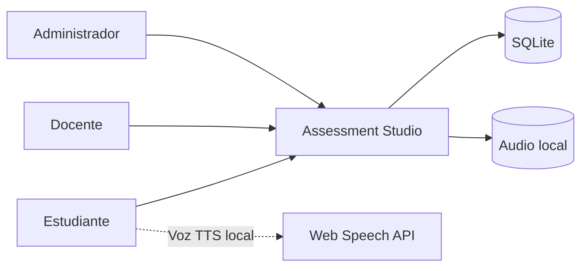

## D02 - Contenedores y módulos

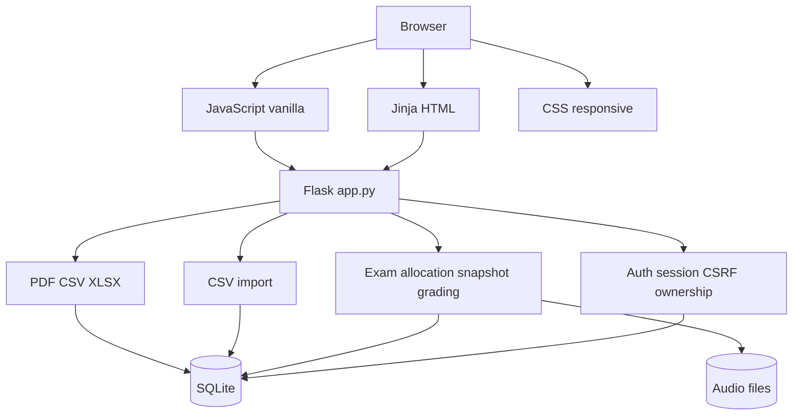

## D03 - Datos

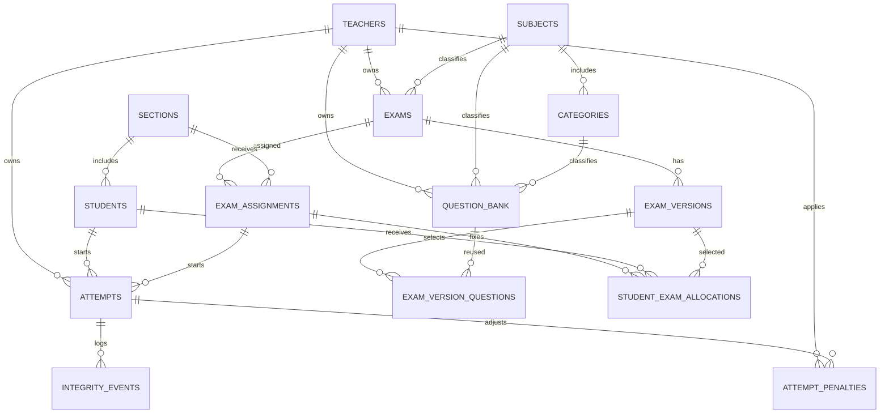

## D04 - Login docente

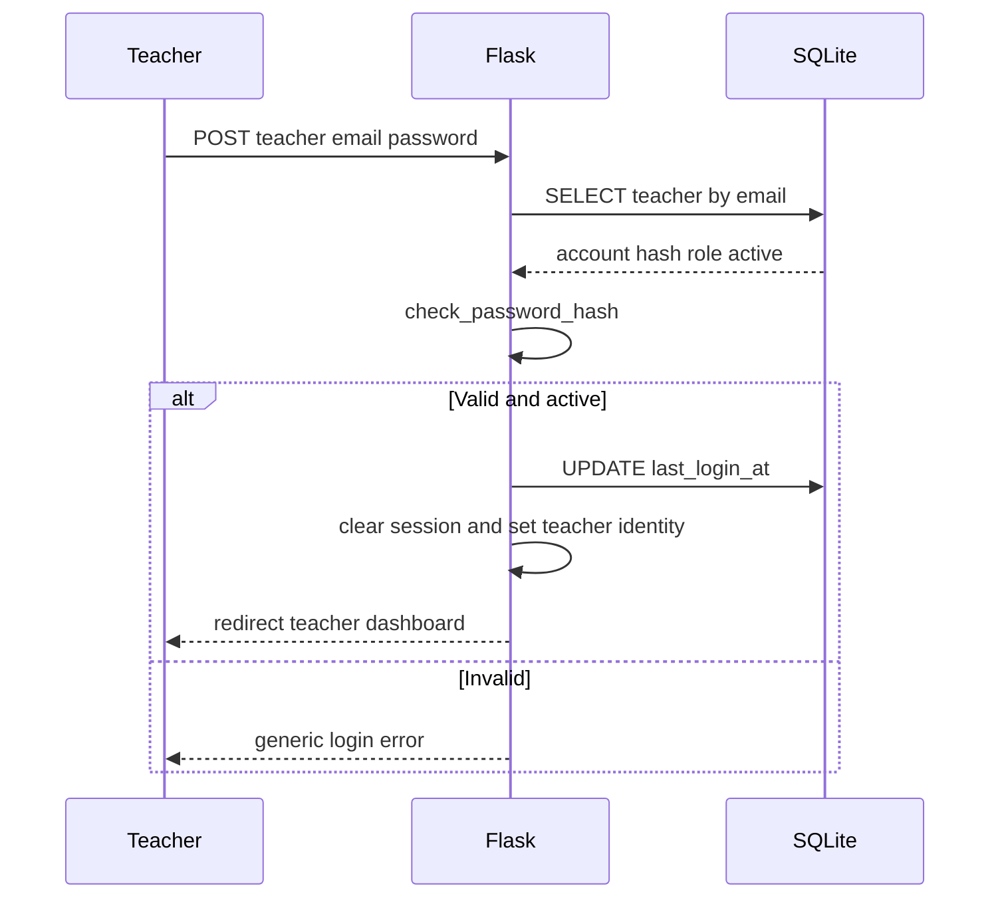

## D05 - Login estudiante y reglas

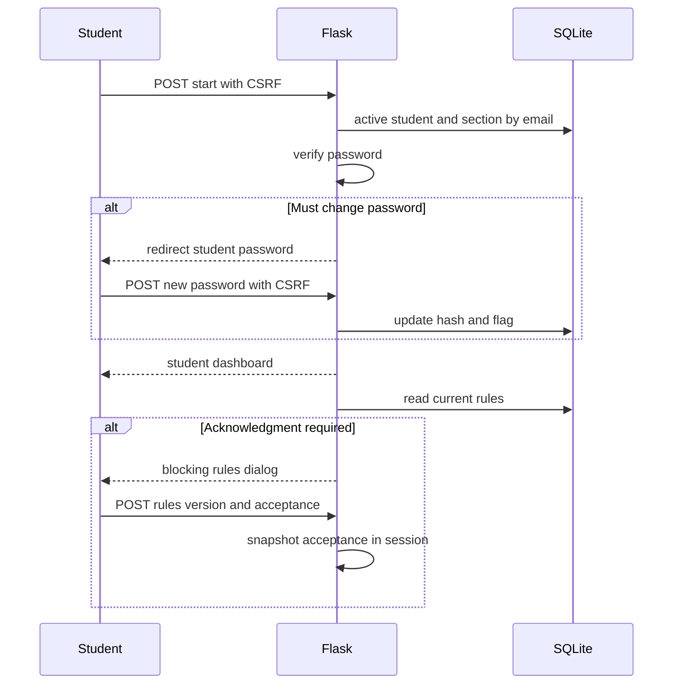

## D06 - Asignación, allocation y snapshot

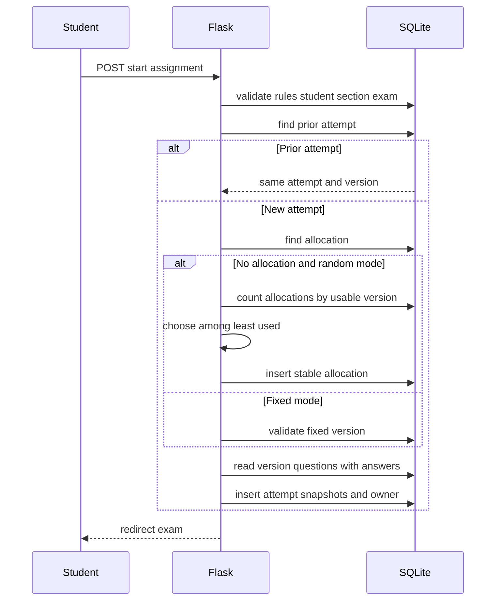

Compatibilidad legacy en este ciclo: si una pregunta listening no tiene `listening_source`, `audio` selecciona archivo; si solo tiene `script`, se conserva como TTS y el guion se obtiene on demand mediante el endpoint autenticado.

## D07 - Respuestas y envío

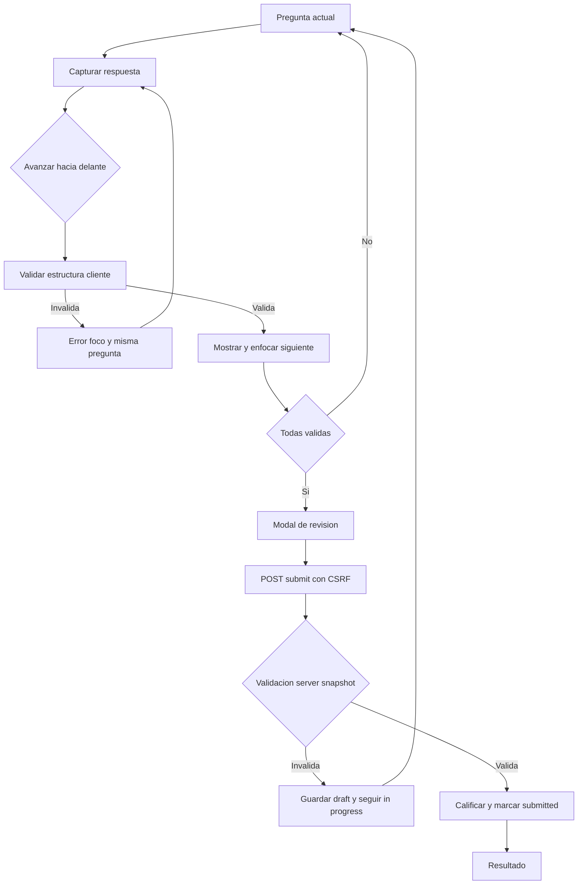

## D08 - Integridad y penalización

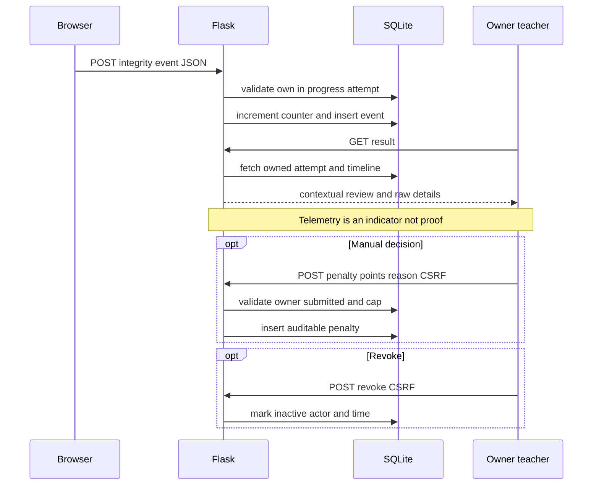

## D09 - Resultados y exportaciones

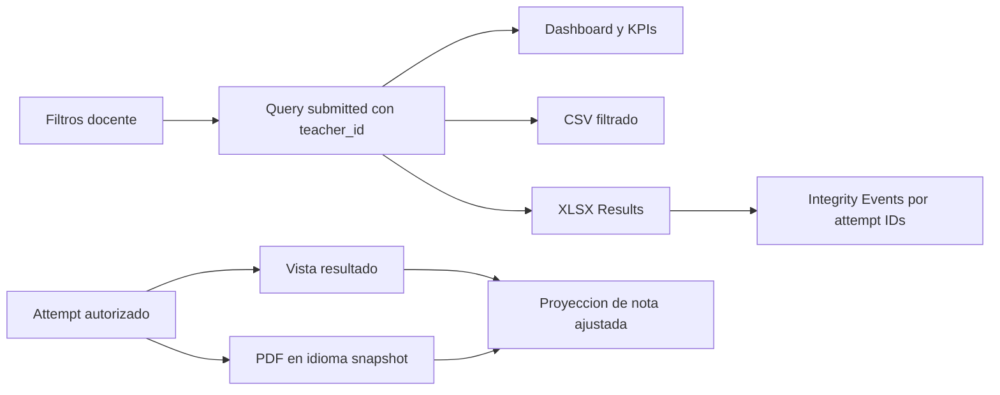

## D10 - Despliegue recomendado

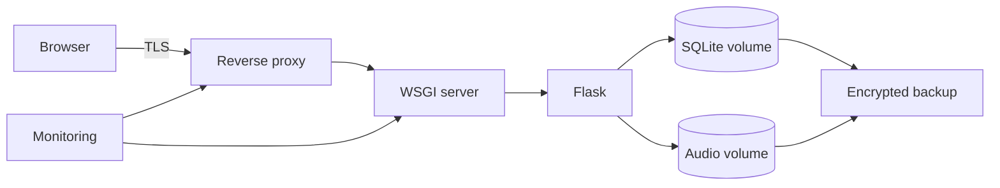

## D11 - CI y calidad

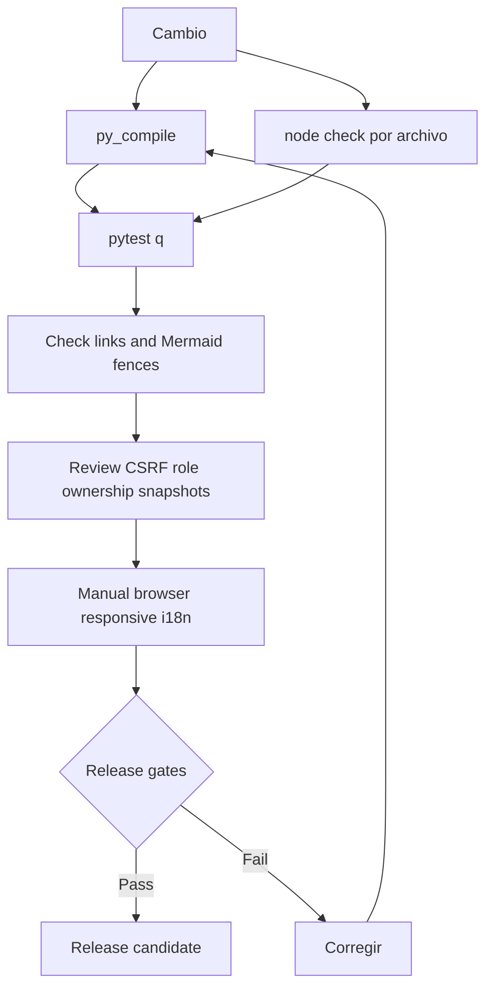

No existe configuración CI en el repositorio; este workflow es **recomendado** y usa comandos locales reales.

## D12 - Incidente y restore

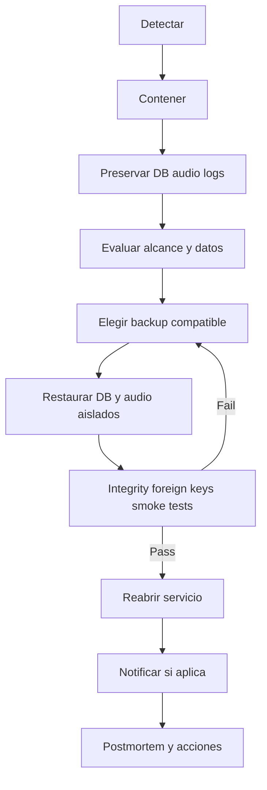

## D13 - Estado de attempt

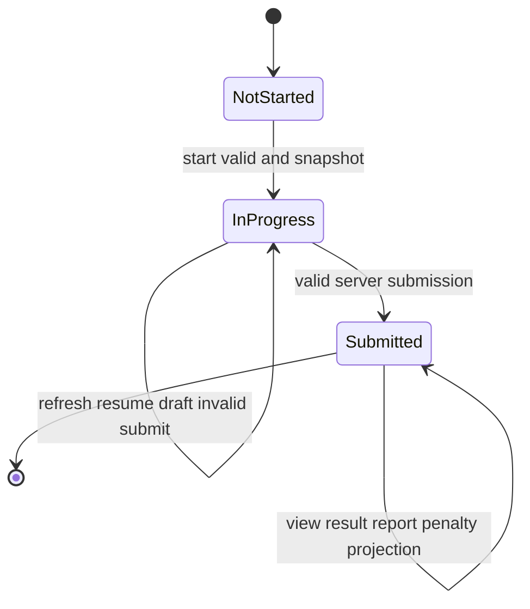

No existe estado cancelado/expirado. Una asignación desactivada después del start sigue visible por el intento existente en portal según la consulta implementada.

## D14 - Estado de exam y version

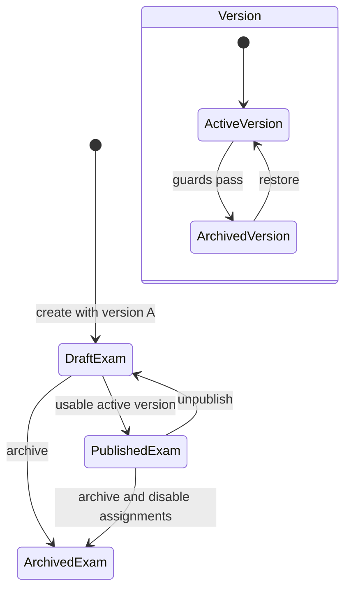

No hay restore de examen archivado en la UI actual; sí existe restore de version.

## D15 - Preparación docente

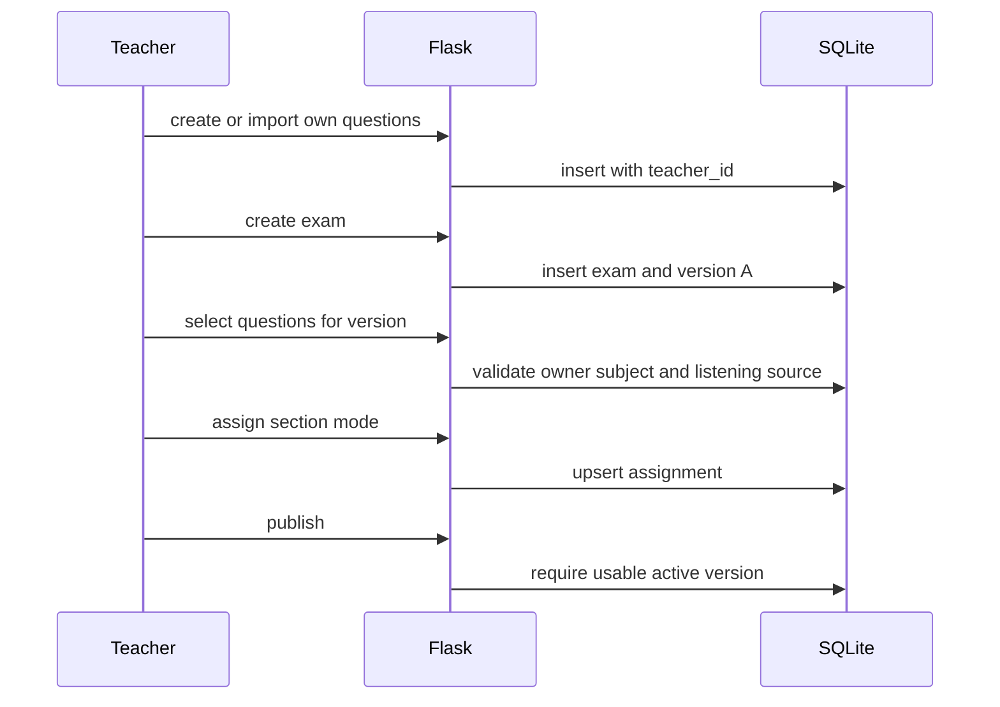

## D16 - Resolución estudiante

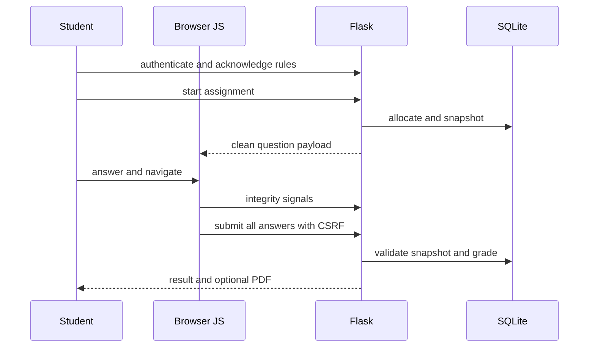
