# 15 - Documento maestro de la aplicación

| Campo | Valor |
|---|---|
| Estado | Consolidado a partir de la implementación verificada |
| Versión | 1.0 |
| Fecha | 2026-09-02 |

## Propósito

Este documento reúne la vista ejecutiva, arquitectónica y operativa de Assessment Studio en una sola referencia de consulta. No reemplaza los documentos especializados; los organiza y los conecta.

## Alcance funcional

Assessment Studio es una plataforma institucional bilingüe para evaluar, corregir y reportar exámenes con:

- múltiples docentes y cuentas administrativas;
- padrón compartido de estudiantes, secciones, asignaturas y categorías;
- banco reutilizable de preguntas por docente;
- exámenes con versiones y asignaciones por sección;
- un intento estable por estudiante y asignación;
- calificación del lado del servidor;
- listening con audio subido o TTS del navegador;
- telemetría de integridad y penalizaciones manuales auditables;
- exportaciones PDF, CSV y XLSX.

## Arquitectura en una vista

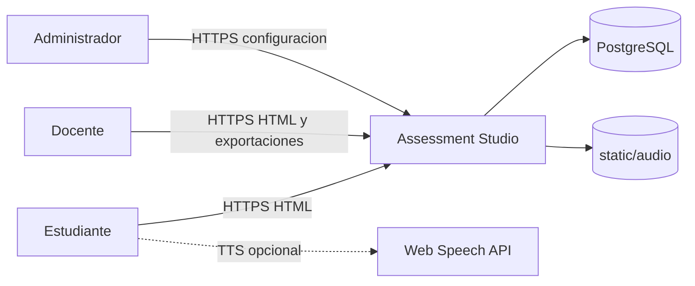

### Contenedores principales

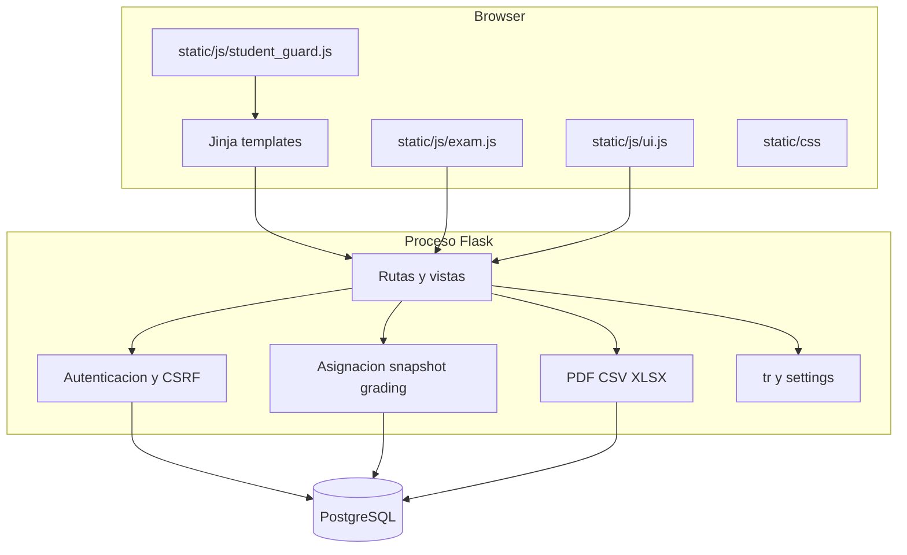

## Modelo de información

Las entidades clave son:

| Dominio | Entidades |
|---|---|
| Identidad | `teachers`, `students`, `sections` |
| Catálogo por docente | `subjects`, `categories` |
| Autoría docente | `question_bank`, `exams`, `exam_versions`, `exam_version_questions` |
| Asignación y ejecución | `exam_assignments`, `student_exam_allocations`, `attempts` |
| Integridad y ajuste | `integrity_events`, `attempt_penalties` |
| Configuración | `app_settings` |

### Relación principal de datos

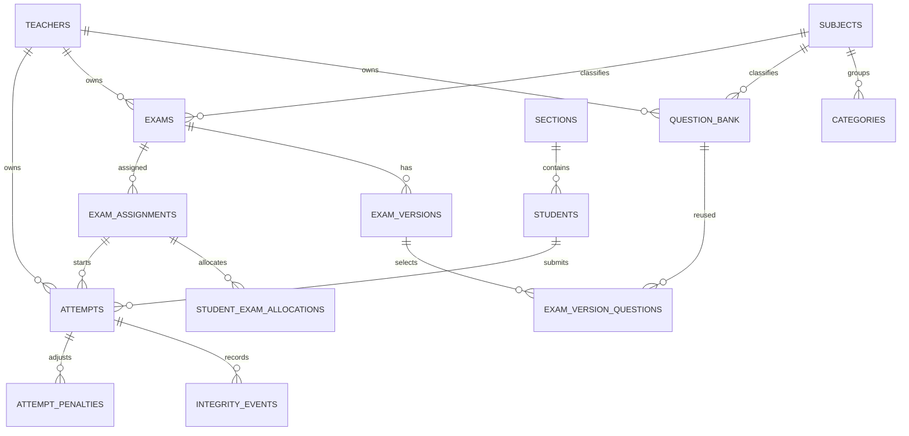

## Flujos principales

### 1. Inicio de sesión docente

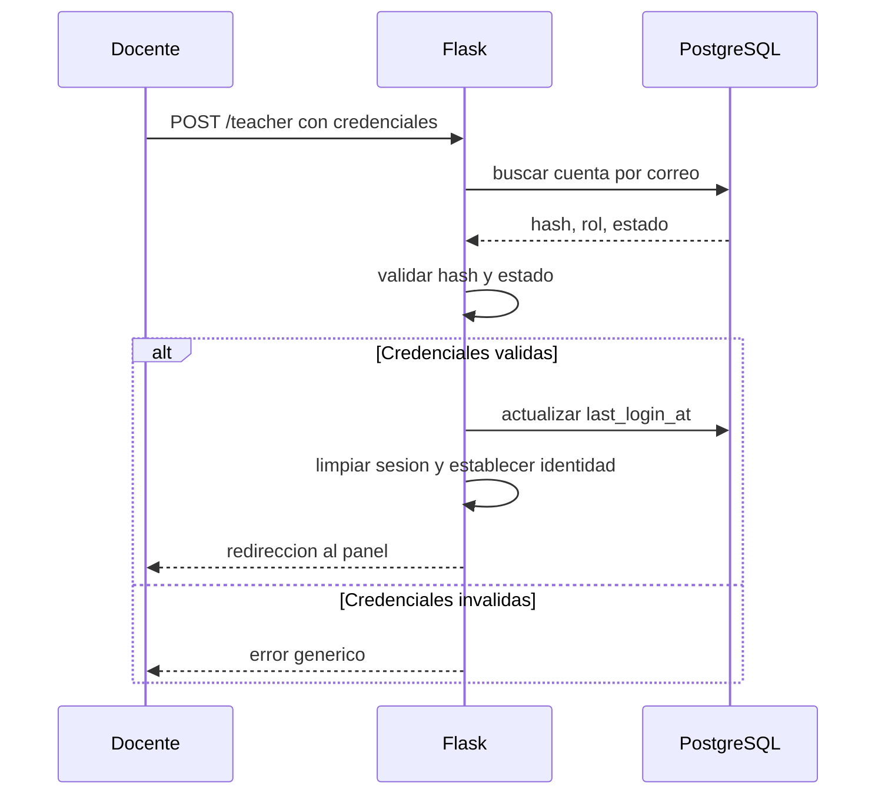

### 2. Inicio de sesión estudiantil y reglas

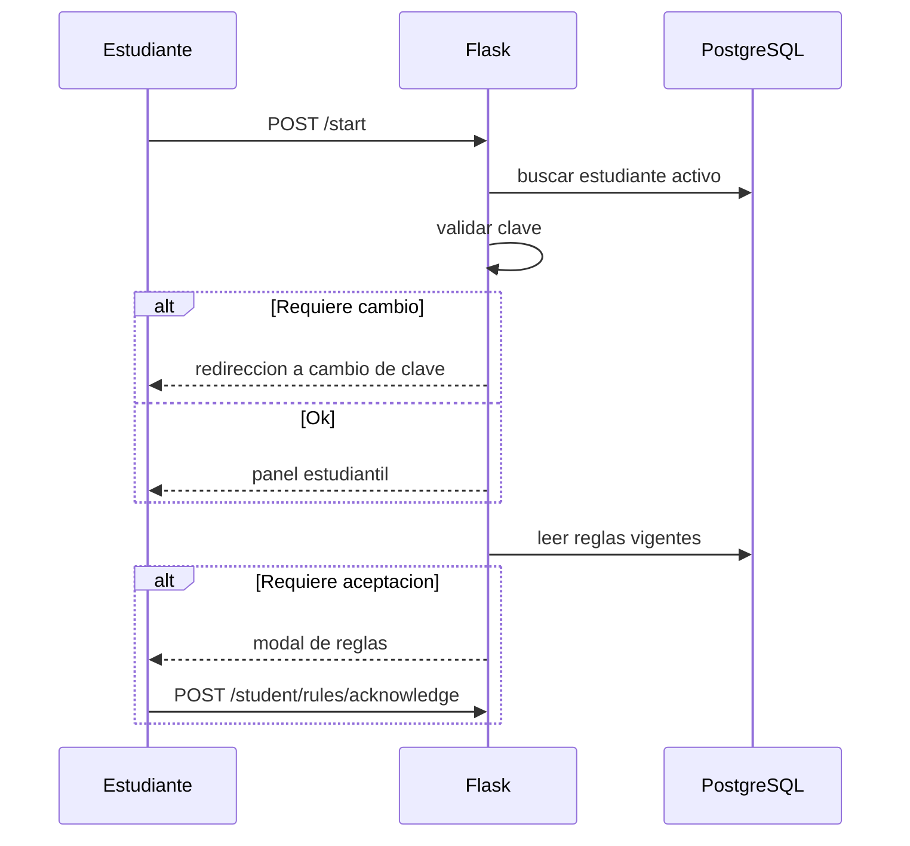

### 3. Asignación, allocation y snapshot

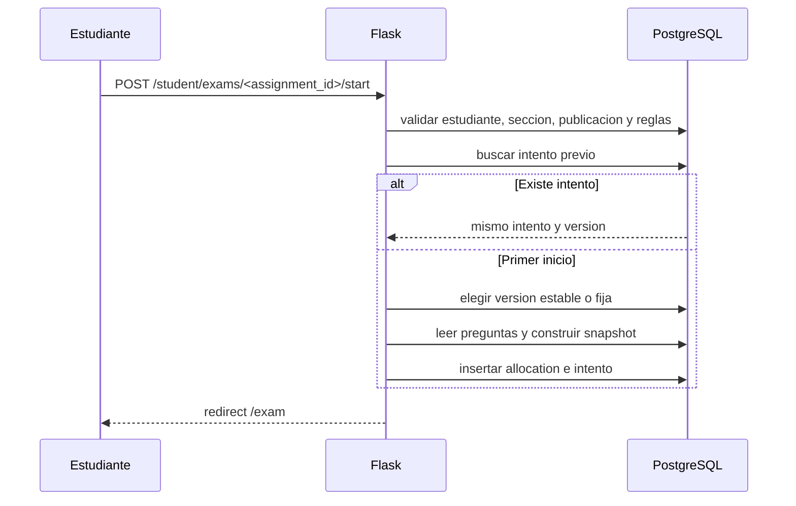

### 4. Resolución del examen y envío

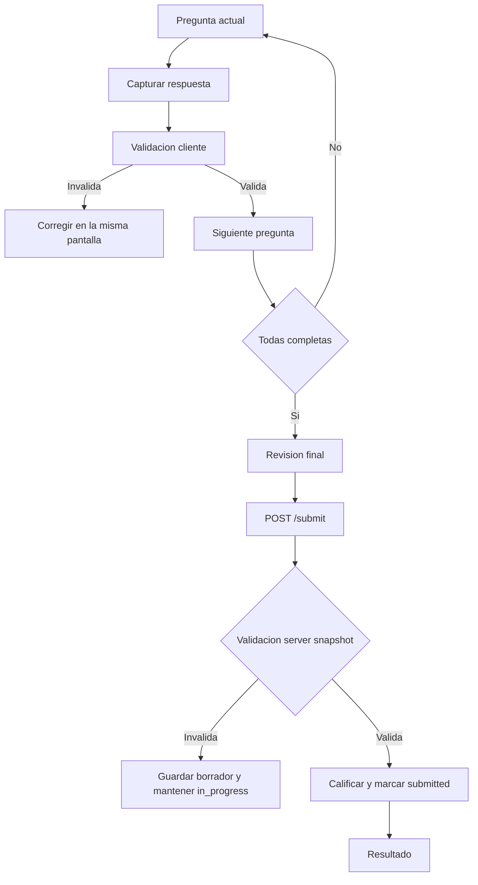

### 5. Integridad y penalizaciones

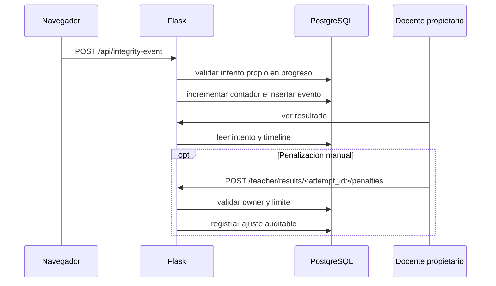

### 6. Resultados y exportaciones

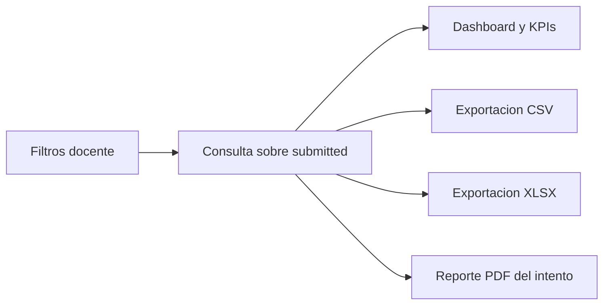

Los exportes imprimibles de exámenes preservan el snapshot, pero barajan de forma determinística opciones/ítems.

## Ciclo de vida del intento

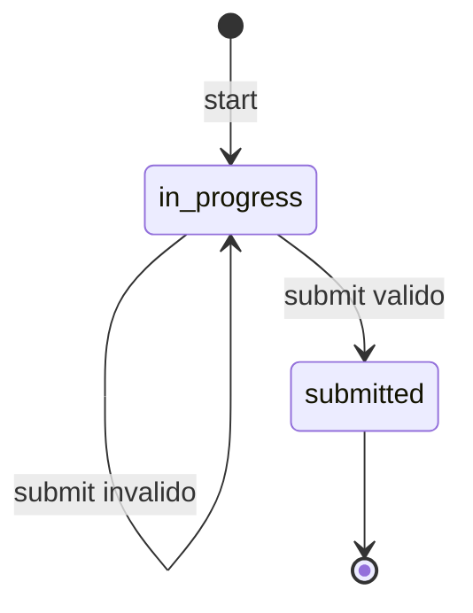

## Ciclo de vida de examen y versiones

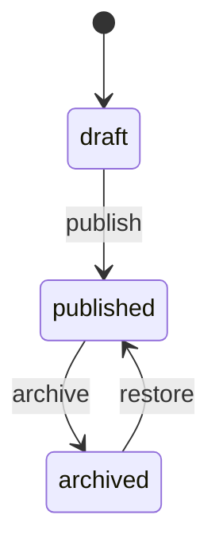

## Operación y despliegue

**Implementado:** Docker Compose levanta PostgreSQL 17 y la aplicación bajo Gunicorn. Las migraciones Alembic se ejecutan antes del arranque, luego corre `bootstrap.py` y finalmente Gunicorn.

**Recomendado:** TLS en reverse proxy, secretos fuera del repositorio, backups probados, monitoreo y restauración ensayada.

## Manuales de usuario

Los manuales vivos están en `userdirections/`:

- [Manual del administrador](../userdirections/manual-administrador.md)
- [Manual del docente](../userdirections/manual-docente.md)
- [Manual del estudiante](../userdirections/manual-estudiante.md)
- [Importación de estudiantes](../userdirections/importacion-estudiantes.md)
- [Importación de preguntas](../userdirections/importacion-preguntas.md)

## Documentación relacionada

| Tema | Documento |
|---|---|
| Resumen ejecutivo | [00-executive-summary.md](00-executive-summary.md) |
| Producto y negocio | [01-product-and-business.md](01-product-and-business.md) |
| Personas y casos de uso | [02-personas-journeys-use-cases.md](02-personas-journeys-use-cases.md) |
| Requisitos | [03-functional-requirements.md](03-functional-requirements.md) |
| UX / UI | [04-ux-design-system.md](04-ux-design-system.md) |
| Arquitectura técnica | [05-architecture.md](05-architecture.md) |
| Modelo de datos | [06-data-model.md](06-data-model.md) |
| Seguridad y privacidad | [07-security-privacy.md](07-security-privacy.md) |
| Desarrollo | [08-development-guide.md](08-development-guide.md) |
| Calidad | [09-quality-strategy.md](09-quality-strategy.md) |
| Operaciones | [10-operations-runbook.md](10-operations-runbook.md) |
| Rutas Flask | [11-api-route-reference.md](11-api-route-reference.md) |
| Diagramas | [12-diagrams.md](12-diagrams.md) |
| ADRs | [13-adrs.md](13-adrs.md) |
| Gobierno y roadmap | [14-glossary-governance-roadmap.md](14-glossary-governance-roadmap.md) |

## Lectura recomendada

1. `docs/README.md`
2. `docs/05-architecture.md`
3. `docs/06-data-model.md`
4. `docs/11-api-route-reference.md`
5. `userdirections/README.md`
