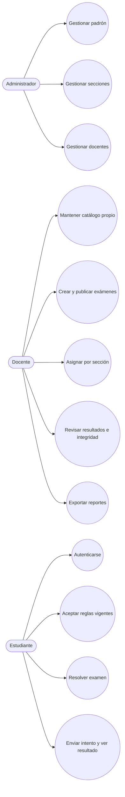

# 17 - Casos de uso

| Campo | Valor |
|---|---|
| Estado | Consolidado a partir de la implementación verificada |
| Versión | 1.0 |
| Fecha | 2026-09-05 |

## Propósito

Este catálogo resume los casos de uso operativos del sistema y su cobertura por rol. Complementa la [referencia de rutas](11-api-route-reference.md) y los [manuales de usuario](../userdirections/README.md).

## Diagrama de casos de uso

## Catálogo por rol

### Administrador

| ID | Caso de uso | Resultado esperado | Referencia |
|---|---|---|---|
| CU-A1 | Gestionar padrón institucional | Altas, ediciones, activación, archivo e importación masiva de estudiantes | [11](11-api-route-reference.md) / manuales |
| CU-A2 | Gestionar secciones | Crear, editar y archivar secciones vacías | [11](11-api-route-reference.md) |
| CU-A3 | Gestionar cuentas docentes | Crear, editar, reponer contraseña y activar/desactivar docentes | [11](11-api-route-reference.md) |

### Docente

| ID | Caso de uso | Resultado esperado | Referencia |
|---|---|---|---|
| CU-D1 | Iniciar sesión docente | Acceso al panel y actualización de último ingreso | [11](11-api-route-reference.md) |
| CU-D2 | Mantener catálogo propio | Crear subjects, categories y preguntas reutilizables | [11](11-api-route-reference.md) |
| CU-D3 | Crear y publicar exámenes | Examen con versión inicial y publicación controlada | [11](11-api-route-reference.md) |
| CU-D4 | Gestionar versiones | Crear, duplicar, archivar y restaurar versiones | [11](11-api-route-reference.md) |
| CU-D5 | Asignar exámenes por sección | Asignaciones fijas o aleatorias persistentes | [11](11-api-route-reference.md) |
| CU-D6 | Revisar resultados e integridad | Ver resultado, timeline y ajustes manuales | [11](11-api-route-reference.md) |
| CU-D7 | Exportar resultados | CSV, XLSX y PDF según contexto | [11](11-api-route-reference.md) |

### Estudiante

| ID | Caso de uso | Resultado esperado | Referencia |
|---|---|---|---|
| CU-E1 | Autenticarse | Sesión activa y validación de estado | [11](11-api-route-reference.md) |
| CU-E2 | Aceptar reglas vigentes | Requisito de acceso al examen cuando corresponde | [11](11-api-route-reference.md) |
| CU-E3 | Resolver examen | Navegación secuencial con validación cliente y servidor | [11](11-api-route-reference.md) |
| CU-E4 | Reanudar intento | Recuperación del mismo attempt y misma versión | [05](05-architecture.md) |
| CU-E5 | Enviar intento y ver resultado | Cierre del attempt y consulta del resultado | [11](11-api-route-reference.md) |

## Flujos resumidos

### CU-E3 Resolver examen

1. El estudiante abre el intento desde `/exam`.
2. El frontend valida respuestas obligatorias antes de avanzar.
3. El servidor conserva el draft y la versión snapshot al recibir `POST /submit`.
4. Si todo es válido, el intento pasa a `submitted`.

### CU-D3 Crear y publicar exámenes

1. El docente crea el examen con su subject.
2. Agrega preguntas a una o más versiones.
3. Publica el examen cuando existe al menos una versión usable.
4. Asigna la evaluación a secciones institucionales.

### CU-A1 Gestionar padrón institucional

1. El admin administra secciones compartidas.
2. Crea o importa estudiantes.
3. Reasigna o archiva registros según necesidad operativa.

## Relaciones entre casos de uso

- **CU-D5** depende de **CU-D3** y **CU-D4**.
- **CU-E3** depende de **CU-E2** cuando las reglas vigentes exigen aceptación.
- **CU-D6** se apoya en la telemetría de integridad, pero la decisión docente sigue siendo manual.
