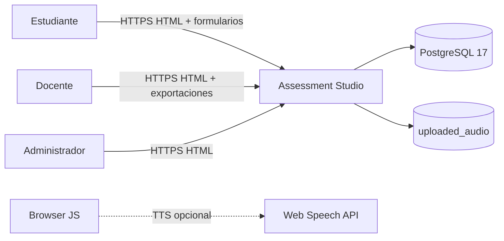
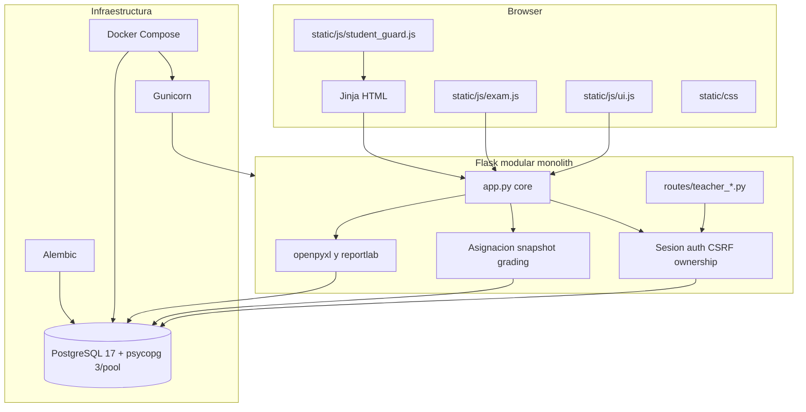
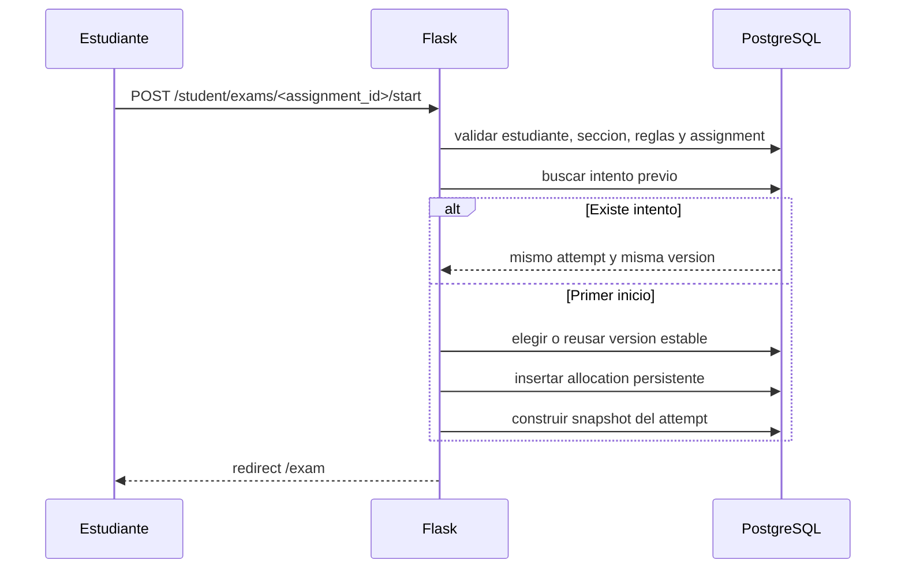
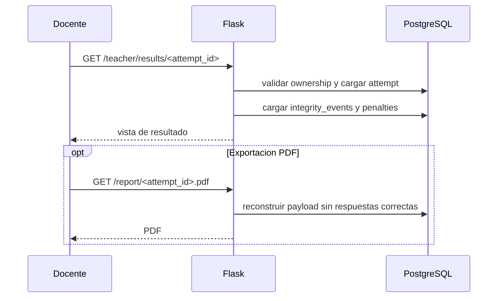
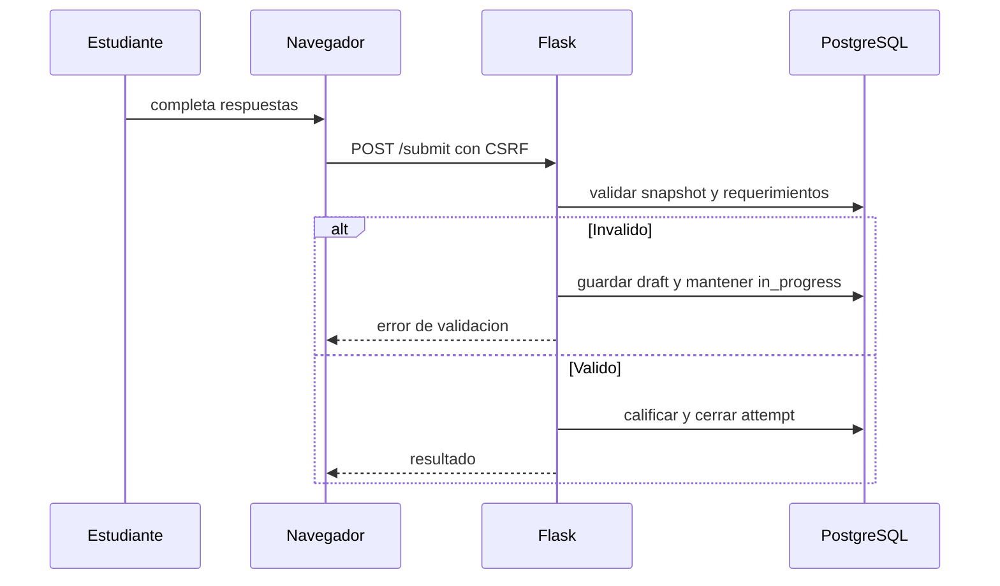

# 18 - Diagramas UML

| Campo | Valor |
|---|---|
| Estado | Consolidado a partir de la implementación verificada |
| Versión | 1.0 |
| Fecha | 2026-09-05 |

## Propósito

Este documento concentra los diagramas UML más útiles para entender el sistema operativo: contexto, componentes y secuencias clave. Evita forzar un diagrama de clases donde no aporta valor real.

## Diagrama de contexto

## Diagrama de componentes

## Secuencia: inicio de asignación y snapshot

## Secuencia: revisión docente y exportación

## Secuencia: envío del intento

## Lectura recomendada

- [05 - Arquitectura técnica](05-architecture.md)
- [11 - Referencia de rutas Flask](11-api-route-reference.md)
- [12 - Catálogo de diagramas](12-diagrams.md)
