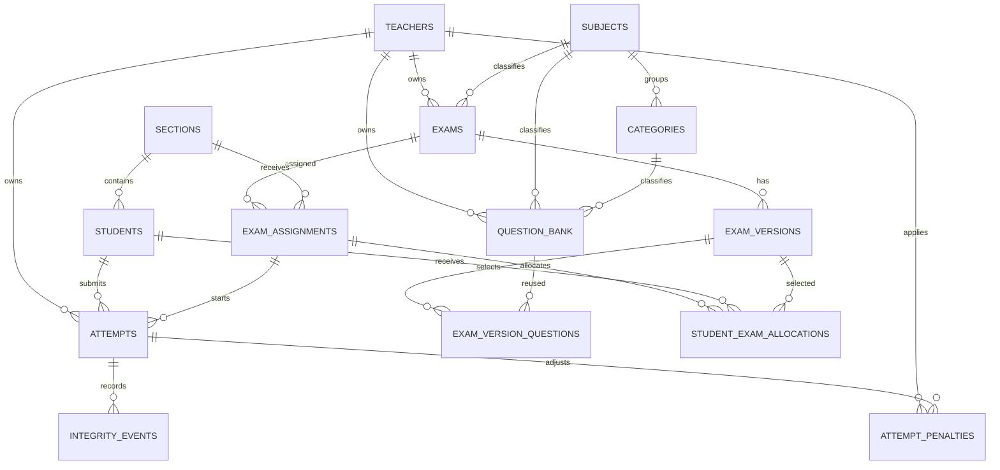

# 19 - ER y modelo de datos

| Campo | Valor |
|---|---|
| Estado | Consolidado a partir de la implementación verificada |
| Versión | 1.0 |
| Fecha | 2026-09-05 |

## Propósito

Este documento presenta el modelo relacional esencial de Assessment Studio y una síntesis de sus reglas de datos. La referencia detallada sigue siendo [06 - Modelo y diccionario de datos](06-data-model.md) y la autoridad de esquema es `migrations/`.

## Diagrama ER

## Resumen del modelo

| Dominio | Tablas | Regla central |
|---|---|---|
| Identidad institucional | `teachers`, `sections`, `students` | `students` y `sections` son compartidos; `teachers` contiene admin y docentes |
| Catálogo por docente | `subjects`, `categories`, `question_bank` | El contenido pertenece a un docente y se clasifica dentro de su propio catálogo |
| Exámenes | `exams`, `exam_versions`, `exam_version_questions` | Un examen puede tener versiones activas e inactivas con preguntas ordenadas |
| Asignación y ejecución | `exam_assignments`, `student_exam_allocations`, `attempts` | La asignación fija o aleatoria se conserva por estudiante y se snapshottea al iniciar |
| Integridad y ajuste | `integrity_events`, `attempt_penalties` | La telemetría no corrige sola; el docente aplica ajustes auditables |
| Configuración | `app_settings` | Parámetros institucionales globales |

## Reglas de datos clave

- Un solo intento por `(student_id, assignment_id)`.
- `teacher_id` es la raíz de ownership para banco, exámenes, intentos y penalizaciones.
- El intento conserva snapshot histórico; las ediciones posteriores del banco no deben reescribirlo.
- `students` y `sections` se comparten a nivel institucional.
- Las exportaciones leen datos ya consolidados desde `attempts`, no recalculan el examen original.

## Notas de implementación

- PostgreSQL 17 es la base soportada.
- Las migraciones viven en Alembic; no hay DDL en tiempo de importación.
- `psycopg 3` con pool es la capa de acceso transaccional.
- La semántica de historial depende de FKs, UQ y snapshots en servidor.

## Lectura recomendada

- [05 - Arquitectura técnica](05-architecture.md)
- [06 - Modelo y diccionario de datos](06-data-model.md)
- [15 - Documento maestro de la aplicación](15-documento-de-la-aplicacion.md)
